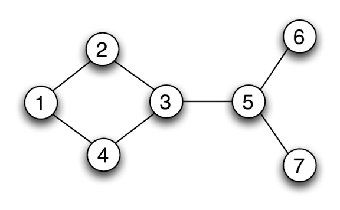
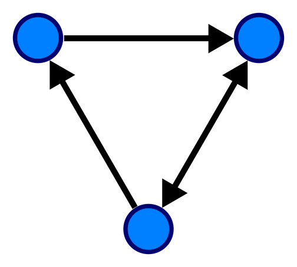

# Graph

<!-- MarkdownTOC -->

- [Definition](#definition)
- [References](#references)

<!-- /MarkdownTOC -->

## Definition

Graph is an abstract data type that is meant to implement the **undirected graph** and **directed graph** concepts from the field of graph theory within mathematics.

A graph data structure consists

- a finite (and possibly mutable) set of _vertices_ (also called _nodes_ or _points_)
- a set of unordered pairs of these vertices for an undirected graph or a set of ordered pairs for a directed graph. These pairs are known as _edges_ (also called _links_ or _lines_), and for a directed graph are also known as _arrows_. The edges may contain weight/value/cost.

## Undirected Graph

## Directed Graph

## References

- <https://en.wikipedia.org/wiki/Graph_(abstract_data_type)>
