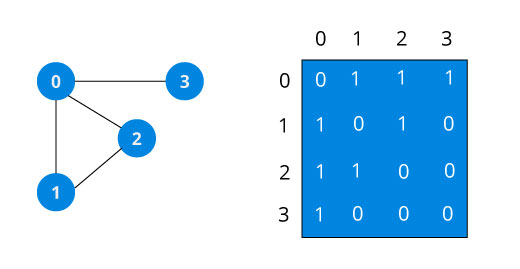
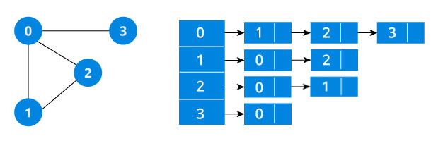
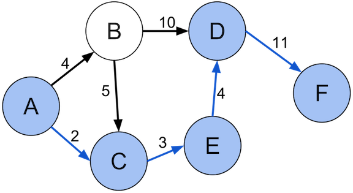
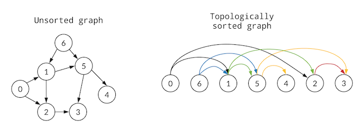

# Graph

<!-- MarkdownTOC -->

- [Definition](#definition)
- [Graph Types](#graph-types)
  - [Undirected Graph](#undirected-graph)
  - [Directed Graph](#directed-graph)
- [Graph Representations](graph-representations)
  - [Adjacency Matrix](#adjacency-matrix)
  - [Adjacency List](#adjacency-list)
- [Applications of Graph](#applications-of-graph)
  - [BFS](#bfs)
    - [Applications of BFS](#applications-of-bfs)
  - [DFS](#dfs)
  - [Shortest Path](#shortest-path)
    - [Dijkstra's algorithm](#dijkstras-algorithm)
  - [Topological Sort](#topological-sort)
    - [Kahn's Algorithm](#kahns-algorithm)
    - [DFS Solution](#dfs-solution)
- [References](#references)

<!-- /MarkdownTOC -->

## Definition

Graph is an abstract data type that is meant to implement the **undirected graph** and **directed graph** concepts from the field of graph theory within mathematics.

A graph data structure consists

- a finite (and possibly mutable) set of _vertices_ (also called _nodes_ or _points_)
- a set of unordered pairs of these vertices for an undirected graph or a set of ordered pairs for a directed graph. These pairs are known as _edges_ (also called _links_ or _lines_), and for a directed graph are also known as _arrows_. The edges may contain weight/value/cost.

## Graph Types

### Undirected Graph


A undirected graph is a pair _G = (V, E)_, where _V_ is a set whose elements are called vertices (singular: vertex), and _E_ is a set of two-sets (sets with two distinct elements) of vertices, whose elements are called edges.

The vertices _x_ and _y_ of an edge _{x, y}_ are called the endpoints of the edge. The edge is said to _join x_ and _y_ and to be _incident_ on _x_ and _y_. A vertex may not belong to any edge.

### Directed Graph


In formal terms, a directed graph is an ordered pair G = (V, A) where[1]

- _V_ is a set whose elements are called vertices, nodes, or points;
- _A_ is a set of ordered pairs of vertices, called arrows, **directed** edges.

## Graph Representations

The representation of graph includes two components

- A finite set of vertices
- A finite set of unordered or ordered pair of the form (u, v) as edges

### Adjacency Matrix



Adjacency Matrix is a 2D array of size V x V where V is the number of vertices in a graph. Let the 2D array be adj[][], a slot adj[i][j] = 1 indicates that there is an edge from vertex i to vertex j. Adjacency matrix for undirected graph is always symmetric. Adjacency Matrix is also used to represent weighted graphs. If adj[i][j] = w, then there is an edge from vertex i to vertex j with weight w.


```java
// Undirected graph without weight
class UndirectedGraph {
    private boolean adjMatrix[][];
    private int numVertices;

    UndirectedGraph(int numVertices) {
        this.numVertices = numVertices;
        adjMatrix = new boolean[numVertices][numVertices];
    }
 
    void addEdge(int i, int j) {
        adjMatrix[i][j] = true;
        adjMatrix[j][i] = true;
    }
 
    void removeEdge(int i, int j) {
        adjMatrix[i][j] = false;
        adjMatrix[j][i] = false;
    }
 
    boolean isEdge(int i, int j) {
        return adjMatrix[i][j];
    }
}

// Directed graph with weight
class DirectedGraph {
    private int adjMatrix[][];
    private int numVertices;

    DirectedGraph(int numVertices) {
        this.numVertices = numVertices;
        adjMatrix = new int[numVertices][numVertices];
    }
 
    void addEdge(int src, int dst, int weight) {
        adjMatrix[src][dst] = weight;
    }
 
    void removeEdge(int src, int dst) {
        adjMatrix[src][dst] = 0;
    }
 
    boolean isEdge(int src, int dst) {
        return adjMatrix[src][dst] > 0;
    }
}
```

### Adjacency List



An array of lists is used. Size of the array is equal to the number of vertices. Let the array be array[]. An entry array[i] represents the list of vertices adjacent to the ith vertex. This representation can also be used to represent a weighted graph. The weights of edges can be represented as lists of pairs. Following is adjacency list representation of the above graph.

```java
// Directed graph w/o weight
class DirectedGraph {
    private int numVertices;
    private LinkedList<Integer>[] adjLists;
 
    DirectedGraph(int vertices) {
        numVertices = vertices;
        adjLists = new LinkedList[vertices];
        
        for (int i = 0; i < vertices; i++)
            adjLists[i] = new LinkedList<Integer>();
    }

    void addEdge(int src, int dst) {
        adjLists[src].add(dst);
    }
 
    void removeEdge(int src, int dst) {
        adjLists[src].remove(dst);
    }
 
    boolean isEdge(int src, int dst) {
        return adjLists[src].contains(dst);
    }
}
```

## Applications of Graph

### BFS

BFS for a graph is similar to BFS for a tree. The only difference is graphs may contain cycles.

```java
// Direct graph with adjacency representation
class Graph {
    private int numVertices;
    private LinkedList<Integer>[] adjLists;

    Graph(int vertices) {
        numVertices = vertices;
        adjLists = new LinkedList[vertices];

        for (int i = 0; i < vertices; i++)
            adjLists[i] = new LinkedList<>();
    }

    void addEdge(int src, int dst) {
        adjLists[src].add(dst);
    }

    void BFS(int start) {
        // Mark all the vertices as not visited (By default set as false)
        boolean visited[] = new boolean[numVertices];
        // Create a queue for BFS
        LinkedList<Integer> queue = new LinkedList<>();

        visited[start]=true;
        queue.add(start);

        while (queue.size() != 0){
            int s = queue.poll();
            System.out.print(s + " ");

            Iterator<Integer> i = adjLists[s].listIterator();
            while (i.hasNext()) {
                int n = i.next();
                if (!visited[n]) {
                    visited[n] = true;
                    queue.add(n);
                }
            }
        }
    }
}
```

```java
// Undirected graph with adjacency matrix representation
class Graph {
    private boolean adjMatrix[][];
    private int numVertices;

    Graph(int numVertices) {
        this.numVertices = numVertices;
        adjMatrix = new boolean[numVertices][numVertices];
    }
 
    void addEdge(int i, int j) {
        adjMatrix[i][j] = true;
        adjMatrix[j][i] = true;
    }

    void BFS(int i, int j) {
        int[] horizontal = {1, 0, -1, 0};
        int[] vertical = {0, 1, 0, -1};

        LinkedList<Integer> hStack = new LinkedList<>();
        LinkedList<Integer> vStack = new LinkedList<>();
        
        boolean[][] visited = new boolean[numVertices][numVertices];

        hStack.push(i);
        vStack.push(j);

        while(!hStack.isEmpty() && !vStack.isEmpty()) {
            int h = hStack.pop();
            int v = vStack.pop();
            
            visited[h][v] = true;
            System.out.print(h + "," + v + " ");

            for (int s = 0; s < 4; s++) {
                int hNext = i + horizontal[s];
                int vNext = j + vertical[s];
                if (hNext >= 0 && hNext < numVertices && vNext >=0 && vNext < numVertices && !visited[hNext][vNext] && adjMatrix[hNext][vNext]) {
                    hStack.push(hNext);
                    vStack.push(vNext);
                }
            }
        }
    }
}
```

#### Applications of BFS

- Shortest Path and Minimum Spanning Tree on unweighted graphs (Breadth-first search can be viewed as a special-case of [Dijkstra's algorithm](https://en.wikipedia.org/wiki/Dijkstra%27s_algorithm) on unweighted graphs)
- Peer to Peer Networks
- Garbage Collection
- Social Networking Websites

### DFS

```java
// Direct graph with adjacency representation
class Graph {
    private int numVertices;
    private LinkedList<Integer>[] adjLists;

    Graph(int vertices) {
        numVertices = vertices;
        adjLists = new LinkedList[vertices];

        for (int i = 0; i < vertices; i++)
            adjLists[i] = new LinkedList<Integer>();
    }

    void addEdge(int src, int dst) {
        adjLists[src].add(dst);
    }

    void DFS(int src) {
        boolean visited[] = new boolean[numVertices];
        DFSRec(src, visited);
    }

    void DFSRec(int src, boolean[] visited) {
        visited[src] = true;
        System.out.print(src + " ");

        List<Integer> l = adjLists[src];
        for (int i = 0; i < l.size(); i++)
            if (!visited[l.get(i)])
                DFSRec(l.get(i), visited);
    }
}
```

```java
// Undirected graph with adjacency matrix representation
class Graph {
    private boolean adjMatrix[][];
    private int numVertices;

    Graph(int numVertices) {
        this.numVertices = numVertices;
        adjMatrix = new boolean[numVertices][numVertices];
    }
 
    void addEdge(int i, int j) {
        adjMatrix[i][j] = true;
        adjMatrix[j][i] = true;
    }

    void DFS(int i, int j) {
        boolean visited[][] = new boolean[numVertices][numVertices];
        DFSRec(i, j, visited);
    }

    void DFSRec(int i, int j, boolean[][] visited) {
        int[] horizontal = {1, 0, -1, 0};
        int[] vertical = {0, 1, 0, -1};

        visited[i][j] = true;
        System.out.print(i + "," + j + " ");

        for (int s = 0; s < 4; s++) {
            int hNext = i + horizontal[s];
            int vNext = j + vertical[s];
            if (hNext >= 0 && hNext < numVertices && vNext >=0 && vNext < numVertices && !visited[hNext][vNext] && adjMatrix[hNext][vNext]) {
                DFSRec(hNext, vNext, visited);
            }
        }
    }
}
```

### Shortest Path



#### Dijkstra's algorithm

```python
function Dijkstra(Graph, source):
    create vertex set Q
    for each vertex v in Graph:             
        dist[v] ← INFINITY                  
        prev[v] ← UNDEFINED                 
        add v to Q                      
    dist[source] ← 0                        
    
    while Q is not empty:
        u ← vertex in Q with min dist[u]    
                                            
        remove u from Q 
        
        for each neighbor v of u:           // only v that are still in Q
            alt ← dist[u] + length(u, v)
            if alt < dist[v]:               
                dist[v] ← alt 
                prev[v] ← u 
    return dist[], prev[]
```

### Topological Sort



A topological sort or topological ordering of a directed graph is a linear ordering of its vertices such that for every directed edge _uv_ from vertex _u_ to vertex _v_, _u_ comes before _v_ in the ordering. 

#### Kahn's algorithm

```python
L ← Empty list that will contain the sorted elements
S ← Set of all nodes with no incoming edge

while S is non-empty do
    remove a node n from S
    add n to tail of L
    for each node m with an edge e from n to m do
        remove edge e from the graph
        if m has no other incoming edges then
            insert m into S

if graph has edges then
    return error   (graph has at least one cycle)
else 
    return L   (a topologically sorted order)
```

The overall time complexity of the algorithm is _O(V+E)_

```java
class Graph {
    private int numVertices;
    private LinkedList<Integer>[] adjLists;

    Graph(int vertices) {
        numVertices = vertices;
        adjLists = new LinkedList[vertices];
        
        for (int i = 0; i < vertices; i++)
            adjLists[i] = new LinkedList<Integer>();
    }

    void addEdge(int src, int dst) {
        adjLists[src].add(dst);
    }

    ArrayList<Integer> TopologicalSort() {
        int[] incoming = new int[numVertices];

        for(int i = 0; i < numVertices; i++) {
            LinkedList<Integer> temp = adjLists[i];
            for(int v : temp) {
                incoming[v]++;
            }
        }

        LinkedList<Integer> q = new LinkedList<Integer>();
        for(int i = 0;i < numVertices; i++) {
            if(incoming[i] == 0)
                q.offer(i); 
        }

        ArrayList<Integer> order = new ArrayList<>();
        while(!q.isEmpty()) {
            int v = q.poll();
            order.add(v);

            LinkedList<Integer> temp = adjLists[v];
            for (Integer n : temp) {
                if (--incoming[n] == 0)
                    q.add(n);
            }
        }

        if (order.size() == numVertices)
            return order;
        else 
            return null;
    }
}
```

#### DFS Solution

```python
L ← Empty list that will contain the sorted nodes
while exists nodes without a permanent mark do
    select an unmarked node n
    visit(n)

function visit(node n)
    if n has a permanent mark then
        return
    if n has a temporary mark then
        stop   (not a DAG)

    mark n with a temporary mark

    for each node m with an edge from n to m do
        visit(m)

    remove temporary mark from n
    mark n with a permanent mark
    add n to head of L
```

## References

- <https://en.wikipedia.org/wiki/Graph_(abstract_data_type)>
- <https://en.wikipedia.org/wiki/Graph_(discrete_mathematics)>
- <https://en.wikipedia.org/wiki/Dijkstra%27s_algorithm>
- <https://www.programiz.com/dsa/graph-adjacency-matrix>
- <https://www.programiz.com/dsa/graph-adjacency-list>
- <https://en.wikipedia.org/wiki/Topological_sorting>
- <https://en.wikipedia.org/wiki/Shortest_path_problem>
