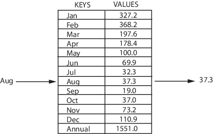
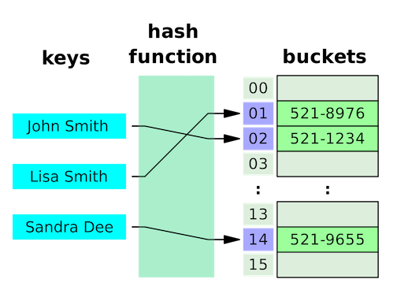
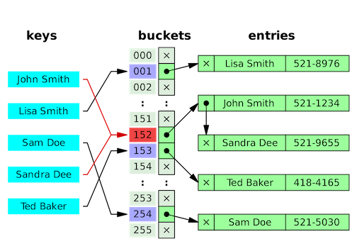
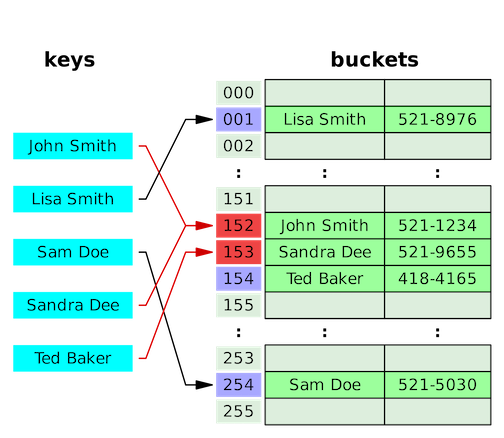

# Map

<!-- MarkdownTOC -->

- [Definition](#definition)
- [HashTable Implementations](#hashtable-implementations)
  - [Hash Function](#hash-function)
  - [Collision](#collision)
- [Map Interface](#map-interface)
  - [Methods in Map](#methods-in-map)
- [HashTable Class](#hashtable-class)
  - [HashTable Constructor](#hashtable-constructor)
  - [Special Methods in HashTable Class](#special-methods-in-hashtable-class)
- [HashMap Class](#hashmap-class)
  - [HashMap Constructor](#hashmap-constructor)
- [HashMap Class](#hashmap-class)
- [Tree Implementations](#tree-implementations)
- [TreeMap Class](#treemap-class)
  - [TreeMap Constructor](#treemap-contructor)
  - [Methods in TreeMap Class](#methods-in-treemap-class)
- [References](#references)

<!-- /MarkdownTOC -->

## Definition

Map, also known as dictionary or associative array, is a collection of _(key, value)_ pairs, such that each possible key appears at most once in the collection.



Operations associated with this data type allow:

- Add or insert: add a new _(key,value)_ pair to the collection, mapping the new key to its new value.
- Reassign: replace the value in one of the _(key,value)_ pairs that are already in the collection, mapping an old key to a new value.
- Remove or delete: remove a _(key,value)_ pair from the collection, unmapping a given key from its value.
- Lookup: find the value (if any) that is bound to a given key.

## HashTable Implementations



The most frequently used general purpose implementation of an associative array or map is with a hash table: an array combined with a _hash function_ that separates each key into a separate "bucket" of the array. The basic idea behind a hash table is that accessing an element via its index is a simple, constant-time operation. Therefore, the average overhead of an operation for a hash table is only the computation of the key's hash, combined with accessing the corresponding bucket within the array. As such, hash tables usually perform in **O(1)** time, and outperform alternatives in most situations.

### Hash Function

Hash function is a function that can be used to map data of arbitrary size to fixed-size values.

```
index = f(key, array_size)
```

A critical statistic for a hash table is the load factor, defined as

```
load_factor = the number of entries occupied in the hash table / the number of buckets
```

As the load factor grows larger, the hash table becomes slower, and it may even fail to work (depending on the method used). The expected constant time property of a hash table assumes that the load factor be kept below some bound.

### Collision

Hash tables need to be able to handle **collisions**: when the hash function maps two different keys to the same bucket of the array. The two most widespread approaches to this problem are **separate chaining** and **open addressing**.



**Separate chaining** with linked lists makes each cell of hash table point to a linked list of records that have same hash function value. Chaining is simple, but requires additional memory outside the table.

Some chaining implementations store the first record of each chain in the slot array itself, known as separate chaining with list head cells.



**Open addressing** stores all elements in the hash table itself. Each table entry contains either a record or NIL. When searching for an element, it examines table slots until the desired element is found or it is clear that the element is not in the table.

A drawback of all these open addressing schemes is that the number of stored entries cannot exceed the number of slots in the bucket array.

### Best Practice

- Use _Double_/_Float_ as hashmap keys is a bad practice. Especially if needing to perform calculations on double keys, the hash of double could mess up.

- Use Object as hashmap keys. When the hashCode() and equals(Object o) methods are not overridden by your class, the default implementation are used. The default behavior is to treat all objects as different, unless they are the same object. _IdentityHashMap_ always does this by using reference-equality in place of object-equality

## Map Interface

An object that maps keys to values. A map cannot contain duplicate keys; each key can map to at most one value.

The Map interface provides three collection views, which allow a map's contents to be viewed as a _set of keys_, _collection of values_, or _set of key-value mappings_.

### Methods in Map

- _boolean containsKey(Object key)_: Returns true if this map contains a mapping for the specified key.

- _boolean containsValue(Object value)_: Returns true if this map maps one or more keys to the specified value.

- _Set<Map.Entry<K,V>> entrySet()_: Returns a Set view of the mappings contained in this map.

- _V get(Object key)_: Returns the value to which the specified key is mapped, or null if this map contains no mapping for the key.

- _default V getOrDefault(Object key, V defaultValue)_: Returns the value to which the specified key is mapped, or defaultValue if this map contains no mapping for the key.

- _boolean isEmpty()_: Returns true if this map contains no key-value mappings.

- _Set<K> keySet()_: Returns a Set view of the keys contained in this map.

- _V put(K key, V value)_: Associates the specified value with the specified key in this map (optional operation).

- _void putAll(Map<? extends K,? extends V> m)_: Copies all of the mappings from the specified map to this map (optional operation).

- _default V putIfAbsent(K key, V value)_: If the specified key is not already associated with a value (or is mapped to null) associates it with the given value and returns null, else returns the current value.

- _V remove(Object key)_: Removes the mapping for a key from this map if it is present (optional operation).

- _default boolean remove(Object key, Object value)_: Removes the entry for the specified key only if it is currently mapped to the specified value.

- _default V replace(K key, V value)_: Replaces the entry for the specified key only if it is currently mapped to some value.

- _default boolean replace(K key, V oldValue, V newValue)_: Replaces the entry for the specified key only if currently mapped to the specified value.

- _int size()_: Returns the number of key-value mappings in this map.

- _Collection<V> values()_: Returns a Collection view of the values contained in this map.

## HashTable Class

This class implements a hash table, which maps keys to values. Any **non-null** object can be used as a key or as a value. To successfully store and retrieve objects from a hash table, the objects used as keys must implement the hashCode method and the equals method.

Generally, the default load factor (.75) offers a good tradeoff between time and space costs.

**Note**, _HashTable_ is synchronized, while _HashMap_ is not. So it is slower than _HashMap_.

### HashTable Constructor

- _Hashtable()_: Constructs a new, empty hashtable with a default initial capacity (11) and load factor (0.75).

- _Hashtable(int initialCapacity)_: Constructs a new, empty hashtable with the specified initial capacity and default load factor (0.75).

- _Hashtable(int initialCapacity, float loadFactor)_: Constructs a new, empty hashtable with the specified initial capacity and the specified load factor.

- _Hashtable(Map<? extends K,? extends V> t)_: Constructs a new hashtable with the same mappings as the given Map.

```java
HashTable<String, Integer> ht1 = new HashTable<>();
HashTable<String, Integer> ht2 = new HashTable<>(100);
HashTable<String, Integer> ht3 = new HashTable<>(100, 0.9);
HashTable<String, Integer> ht4 = new HashTable<>(ht3);
```

### Special Methods in HashTable Class

- _void clear()_: Clears this hashtable so that it contains no keys.

- _Enumeration<V> elements()_: Returns an enumeration of the values in this hashtable.

- _Enumeration<K> keys()_: Returns an enumeration of the keys in this hashtable.

- _protected void rehash()_: Increases the capacity of and internally reorganizes this hashtable, in order to accommodate and access its entries more efficiently.

- _String toString()_: Returns a string representation of this Hashtable object in the form of a set of entries, enclosed in braces and separated by the ASCII characters ", " (comma and space).

## HashMap Class

HashMap is a hash table based implementation of the Map interface. This implementation provides all of the optional map operations, and **permits** _null_ values and the _null_ key. (The HashMap class is roughly equivalent to Hashtable, except that it is **unsynchronized** and **permits nulls**.) This class makes no guarantees as to the order of the map; in particular, it does not guarantee that the order will remain constant over time.

This implementation provides **constant-time** performance for the basic operations (_get_ and _put_), assuming the hash function disperses the elements properly among the buckets.

Why HashTable doesn’t allow null and HashMap does?
To successfully store and retrieve objects from a HashTable, the objects used as keys must implement the hashCode method and the equals method. Since null is not an object, it can’t implement these methods. HashMap is an advanced version and improvement on the Hashtable. HashMap was created later.

### HashMap Constructor

- _HashMap()_: Constructs a new, empty HashMap with a default initial capacity (11) and load factor (0.75).

- _HashMap(int initialCapacity)_: Constructs a new, empty HashMap with the specified initial capacity and default load factor (0.75).

- _HashMap(int initialCapacity, float loadFactor)_: Constructs a new, empty HashMap with the specified initial capacity and the specified load factor.

- _HashMap(Map<? extends K,? extends V> t)_: Constructs a new HashMap with the same mappings as the given Map.

```java
HashMap<String, Integer> map1 = new HashMap<>();
HashMap<String, Integer> map2 = new HashMap<>(100);
HashMap<String, Integer> map3 = new HashMap<>(100, 0.9);
HashMap<String, Integer> map4 = new HashMap<>(map3);
```

## Tree Implementations

Another common approach is to implement an associative array with a self-balancing binary search tree, such as an AVL tree or a red-black tree.

Compared to hash tables, these structures have both advantages and weaknesses. The worst-case performance of self-balancing binary search trees is significantly better than that of a hash table, with a time complexity in big-O notation of _O(log n)_. This is in contrast to hash tables, whose worst-case performance involves all elements sharing a single bucket, resulting in _O(n)_ time complexity. In addition, and like all binary search trees, self-balancing binary search trees keep their elements in order. Thus, traversing its elements follows a least-to-greatest pattern, whereas traversing a hash table can result in elements being in seemingly random order. However, hash tables have a much better average-case time complexity than self-balancing binary search trees of _O(1)_, and their worst-case performance is highly unlikely when a good hash function is used.

## TreeMap Class

A Red-Black tree based NavigableMap implementation. The map is sorted according to the natural ordering of its keys, or by a Comparator provided at map creation time, depending on which constructor is used.

This implementation provides guaranteed **_log(n)_** time cost for the _containsKey_, _get_, _put_ and _remove_ operations.

### TreeMap Constructor

- _TreeMap()_: Constructs a new, empty tree map, using the natural ordering of its keys.

- _TreeMap(Comparator<? super K> comparator)_: Constructs a new, empty tree map, ordered according to the given comparator.

- _TreeMap(Map<? extends K,? extends V> m)_: Constructs a new tree map containing the same mappings as the given map, ordered according to the natural ordering of its keys.

- _TreeMap(SortedMap<K,? extends V> m)_: Constructs a new tree map containing the same mappings and using the same ordering as the specified sorted map.

### Methods in TreeMap Class

- _Map.Entry<K,V>	ceilingEntry(K key)_: Returns a key-value mapping associated with the least key greater than or equal to the given key, or _null_ if there is no such key.

- _K	ceilingKey(K key)_: Returns the least key greater than or equal to the given key, or _null_ if there is no such key.

- _Comparator<? super K>	comparator()_: Returns the comparator used to order the keys in this map, or _null_ if this map uses the natural ordering of its keys.

- _boolean	containsKey(Object key)_: Returns true if this map contains a mapping for the specified key.

- _boolean	containsValue(Object value)_: Returns true if this map maps one or more keys to the specified value.

- _NavigableSet<K>	descendingKeySet()_: Returns a reverse order NavigableSet view of the keys contained in this map.

- _NavigableMap<K,V>	descendingMap()_: Returns a reverse order view of the mappings contained in this map.

- _Set<Map.Entry<K,V>>	entrySet()_: Returns a Set view of the mappings contained in this map.

- _Map.Entry<K,V>	firstEntry()_: Returns a key-value mapping associated with the least key in this map, or _null_ if the map is empty.

- _K	firstKey()_: Returns the first (lowest) key currently in this map.

- _Map.Entry<K,V>	floorEntry(K key)_: Returns a key-value mapping associated with the greatest key less than or equal to the given key, or _null_ if there is no such key.

- _K	floorKey(K key)_: Returns the greatest key less than or equal to the given key, or null if there is no such key.

- _V	get(Object key)_: Returns the value to which the specified key is mapped, or null if this map contains no mapping for the key.

- _SortedMap<K,V>	headMap(K toKey)_: Returns a view of the portion of this map whose keys are strictly less than toKey.

- _NavigableMap<K,V>	headMap(K toKey, boolean inclusive)_: Returns a view of the portion of this map whose keys are less than (or equal to, if inclusive is true) toKey.

- _Map.Entry<K,V>	higherEntry(K key)_: Returns a key-value mapping associated with the least key strictly greater than the given key, or null if there is no such key.

- _K	higherKey(K key)_: Returns the least key strictly greater than the given key, or null if there is no such key.

- _Set<K>	keySet()_: Returns a Set view of the keys contained in this map.

- _Map.Entry<K,V>	lastEntry()_: Returns a key-value mapping associated with the greatest key in this map, or null if the map is empty.

- _K	lastKey()_: Returns the last (highest) key currently in this map.

- _Map.Entry<K,V>	lowerEntry(K key)_: Returns a key-value mapping associated with the greatest key strictly less than the given key, or null if there is no such key.

- _K	lowerKey(K key)_: Returns the greatest key strictly less than the given key, or null if there is no such key.

- _NavigableSet<K>	navigableKeySet()_: Returns a NavigableSet view of the keys contained in this map.

- _Map.Entry<K,V>	pollFirstEntry()_: Removes and returns a key-value mapping associated with the least key in this map, or null if the map is empty.

- _Map.Entry<K,V>	pollLastEntry()_: Removes and returns a key-value mapping associated with the greatest key in this map, or null if the map is empty.

- _V	put(K key, V value)_: Associates the specified value with the specified key in this map.

- _void	putAll(Map<? extends K,? extends V> map)_: Copies all of the mappings from the specified map to this map.

- _V	remove(Object key)_: Removes the mapping for this key from this TreeMap if present.

- _V	replace(K key, V value)_: Replaces the entry for the specified key only if it is currently mapped to some value.

- _boolean	replace(K key, V oldValue, V newValue)_: Replaces the entry for the specified key only if currently mapped to the specified value.

- _int	size()_: Returns the number of key-value mappings in this map.

- _NavigableMap<K,V>	subMap(K fromKey, boolean fromInclusive, K toKey, boolean toInclusive)_: Returns a view of the portion of this map whose keys range from fromKey to toKey.

- _SortedMap<K,V>	subMap(K fromKey, K toKey)_: Returns a view of the portion of this map whose keys range from fromKey, inclusive, to toKey, exclusive.

- _SortedMap<K,V>	tailMap(K fromKey)_: Returns a view of the portion of this map whose keys are greater than or equal to fromKey.

- _NavigableMap<K,V>	tailMap(K fromKey, boolean inclusive)_: Returns a view of the portion of this map whose keys are greater than (or equal to, if inclusive is true) fromKey.

- _Collection<V>	values()_: Returns a Collection view of the values contained in this map.

## References

- <https://en.wikipedia.org/wiki/Associative_array>
- <https://en.wikipedia.org/wiki/Hash_table>
- <https://docs.oracle.com/javase/8/docs/api/java/util/Map.html>
- <https://docs.oracle.com/javase/8/docs/api/java/util/Hashtable.html>
- <https://docs.oracle.com/javase/8/docs/api/java/util/HashMap.html>
- <https://docs.oracle.com/javase/8/docs/api/java/util/TreeMap.html>
