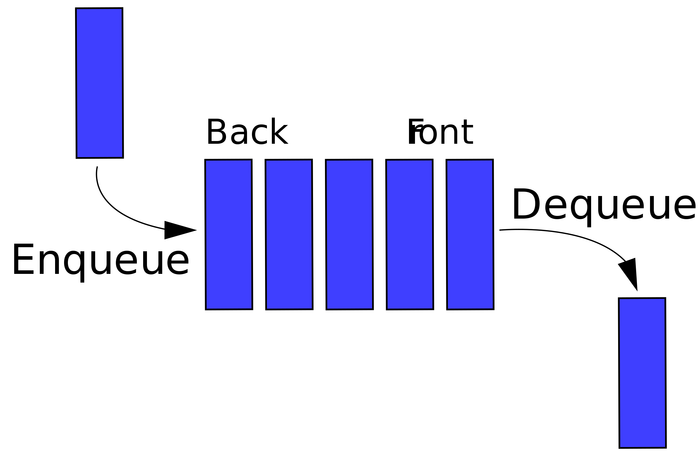

# Queue

<!-- MarkdownTOC -->
- [Queue Interface in Java](#queue-interface-in-java)
- [PriorityQueue Class in Java](#priorityqueue-class-in-java)
- [LinkedList Class in Java](#linkedlist-class-in-java)

<!-- /MarkdownTOC -->

A **queue** is a data structure maintaining a collection of entities in a sequence, which usually follow first-in-first-out (FIFO) order. 

Time complexity in big O notation is 

| Algorithm | Average | Worst case |
|:---------:|:-------:|:----------:|
| Space | _O(n)_ | _O(n)_ |
| Search | _O(n)_ | _O(n)_ |
| Insert | _O(1)_ | _O(1)_ |
| Delete | _O(1)_ | _O(1)_ |

# _Queue_ Interface in Java

# _PriorityQueue_ Class in Java

# _LinkedList_ Class in Java

