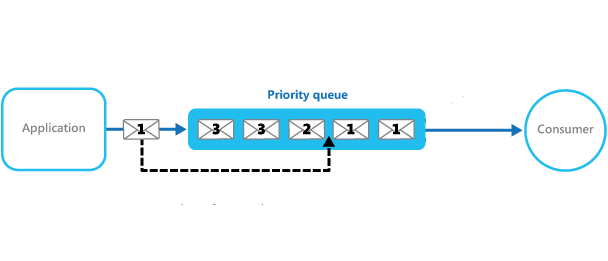

# Queue

<!-- MarkdownTOC -->
- [Queue Interface](#queue-interface)
  - [Special Methods in Queue Interface](#special-methods-in-queue-interface)
  - [LinkedList Class for Queue](#linkedlist-class-for-queue)
- [PriorityQueue Class](#priorityqueue-class)
  - [Constructor](#constructor)
  - [Special Methods in PriorityQueue](#special-methods-in-priorityqueue)
  - [Applications of PriorityQueue](#applications-of-priorityqueue)
    - [Top K Problems](#top-k-problems)
- [Deque Interface](#deque-interface)
  - [Special Methods in Deque](#special-methods-in-deque)
  - [LinkedList Class for Deque](#linkedlist-class-for-deque)
  - [ArrayDeque Class](#arraydeque-class)
  - [Applications of Deque](#applications-of-deque)
    - [Sliding Window Maximum](#sliding-window-maximum)
- [BlockingQueue Interface](#blockingqueue-interface)

<!-- /MarkdownTOC -->

A **queue** is a data structure maintaining a collection of entities in a sequence, which usually follow first-in-first-out (FIFO) order. 


Time complexity in _big-O_ notation is 

| Algorithm | Average | Worst case |
|:---------:|:-------:|:----------:|
| Space | _O(n)_ | _O(n)_ |
| Search | _O(n)_ | _O(n)_ |
| Insert | _O(1)_ | _O(1)_ |
| Delete | _O(1)_ | _O(1)_ |

## Queue Interface

The _Queue_ interface extends the _Collection_ interface and provides extra operations. 

### Special Methods in _Queue_ Interface

- _boolean offer(E e)_: Inserts the specified element into this queue if it is possible to do so immediately without violating capacity restrictions.

- _E peek()_: Retrieves, but does not remove, the head of this queue, or returns null if this queue is empty.

- _E poll()_: Retrieves and removes the head of this queue, or returns null if this queue is empty.

### LinkedList Class for Queue

_LinkedList_ class implements standard _Queue_ interface.

```java
Queue<String> q = new LinkedList<String>();

q.offer("element 1");
q.offer("element 2");
q.offer("element 3");

String s = q.poll();    // "element 1"
s = q.peek();           // "element 2"
```

## PriorityQueue Class



_PriorityQueue_ class in Java is an _unbounded_ priority queue based on a **priority heap**, which also implements _Queue_ interface. The elements of the priority queue are ordered according to their natural ordering, or by a Comparator provided at queue construction time. So, a priority queue does not permit _null_ elements or _non-comparable_ objects.

The head of this queue is the least element with respect to the specified ordering. If multiple elements are tied for least value, the head is one of those elements -- ties are broken arbitrarily.

Note that this implementation is not synchronized.

The time complexity of operations in _PriorityQueue_ class in _big-O_ notation is 

| Operation | Average | Worst case |
|:---------:|:-------:|:----------:|
| _offer_ | _O(log(n))_ | _O(log(n))_ |
| _poll_ | _O(log(n))_ | _O(log(n))_ |
| _remove_ | _O(log(n))_ | _O(log(n))_ |
| _add_ | _O(log(n))_ | _O(log(n))_ |
| _remove_ | _O(n)_ | _O(n)_ |
| _contains_ | _O(n)_ | _O(n)_ |
| _peek_ | _O(1)_ | _O(1)_ |
| _size_ | _O(1)_ | _O(1)_ |

### Constructor

- _PriorityQueue()_: Creates a PriorityQueue with the default initial capacity (11) that orders its elements according to their **natural ordering**.

- _PriorityQueue(Collection<? extends E> c)_: Creates a PriorityQueue containing the elements in the specified collection.

- _PriorityQueue(Comparator<? super E> comparator)_: Creates a PriorityQueue with the default initial capacity and whose elements are ordered according to the specified comparator.

- _PriorityQueue(int initialCapacity)_: Creates a PriorityQueue with the specified initial capacity that orders its elements according to their **natural ordering**.

- _PriorityQueue(int initialCapacity, Comparator<? super E> comparator)_: Creates a PriorityQueue with the specified initial capacity that orders its elements according to the specified comparator.

- _PriorityQueue(PriorityQueue<? extends E> c)_: Creates a PriorityQueue containing the elements in the specified priority queue.

- _PriorityQueue(SortedSet<? extends E> c)_: Creates a PriorityQueue containing the elements in the specified sorted set.

### Special Methods in PriorityQueue

_PriorityQueue_ class implements the interface of _Queue_, _Collection_ and _Iterable_.

```java
// Min queue as default
PriorityQueue<Integer> pQueue = new PriorityQueue<Integer>(); 
  
pQueue.add(10); 
pQueue.add(20); 
pQueue.add(15); 

System.out.println(pQueue.peek()); // 10
System.out.println(pQueue.poll()); // 10
System.out.println(pQueue.peek()); // 15
```

```java
// Max queue
PriorityQueue<Integer> pQueue = new PriorityQueue<Integer>((x, y) -> y - x); 
  
pQueue.add(10); 
pQueue.add(20); 
pQueue.add(15); 

System.out.println(pQueue.peek()); // 20
System.out.println(pQueue.poll()); // 20
System.out.println(pQueue.peek()); // 15
```

### Applications of PriorityQueue

#### Top K Problems

Definition: calculate the top K most frequent characters in a string.

Solutions:
- Use TreeMap to maintain topK sorted order. Suppose m is the number of input and n is the number of distinct input, then build treemap requires O(mlogn), + nlogn) complexity.
- A more efficient approach is to use HashMap + PriorityQueue.

```java
// initialize
Map<Character, Integer> histogram = new HashMap<>();
histogram.put( 'c', 10 );
histogram.put( 'a', 12 );
histogram.put( 'b', 6 );
// output according to priorityqueue
Queue<Map.Entry<Character, Integer>> maxQueue = new PriorityQueue<>((o1, o2) -> o2.getValue() - o1.getValue());
maxQueue.addAll( histogram.entrySet() );
return maxQueue.stream()
                .sorted((o1, o2) -> (o2.getValue() - o1.getValue()))
                .limit(k)
                .map(o -> o.getKey())
                .collect(Collectors.toList());
```

## Deque Interface


_Deque_ is a linear collection that supports element insertion and removal at both ends. The name "deque" is short for "double ended queue" and is usually pronounced "deck".

_Deque_ can be used as a queue (first-in-first-out/FIFO) or as a stack (last-in-first-out/LIFO). These are faster than Stack and LinkedList.

### Special Methods in Deque

Summary of Deque methods

|Operation| First Element (Head) _Throws exception_ | First Element (Head) _Special value_  | Last Element (Tail) _Throws exception_ |  Last Element (Tail) _Special value_ |
|:-:|:-------:|:----------:|:--------:|:--------:|
|Insert|addFirst(e)|offerFirst(e)|addLast(e)|offerLast(e)|
|Remove|removeFirst()|pollFirst()|removeLast()|pollLast()|
|Examine|getFirst()|peekFirst()|getLast()|peekLast()|

- _boolean add(E e)_: Inserts the specified element into the queue represented by this deque (in other words, at the tail of this deque) if it is possible to do so immediately without violating capacity restrictions, returning true upon success and throwing an IllegalStateException if no space is currently available.

- _void	addFirst(E e)_: Inserts the specified element at the front of this deque if it is possible to do so immediately without violating capacity restrictions, throwing an IllegalStateException if no space is currently available.

- _void	addLast(E e)_: Inserts the specified element at the end of this deque if it is possible to do so immediately without violating capacity restrictions, throwing an IllegalStateException if no space is currently available.

- _E getFirst()_: Retrieves, but does not remove, the first element of this deque.

- _E getLast()_: Retrieves, but does not remove, the last element of this deque.

- _boolean offer(E e)_: Inserts the specified element into the queue represented by this deque (in other words, at the tail of this deque) if it is possible to do so immediately without violating capacity restrictions, returning true upon success and false if no space is currently available.

- _boolean offerFirst(E e)_: Inserts the specified element at the front of this deque unless it would violate capacity restrictions.

- _boolean offerLast(E e)_: Inserts the specified element at the end of this deque unless it would violate capacity restrictions.

- _E peek()_: Retrieves, but does not remove, the head of the queue represented by this deque (in other words, the first element of this deque), or returns null if this deque is empty.

- _E peekFirst()_: Retrieves, but does not remove, the first element of this deque, or returns null if this deque is empty.

- _E peekLast()_: Retrieves, but does not remove, the last element of this deque, or returns null if this deque is empty.

- _E poll()_: Retrieves and removes the head of the queue represented by this deque (in other words, the first element of this deque), or returns null if this deque is empty.

- _E pollFirst()_: Retrieves and removes the first element of this deque, or returns null if this deque is empty.

- _E pollLast()_: Retrieves and removes the last element of this deque, or returns null if this deque is empty.

- _E remove()_: Retrieves and removes the head of the queue represented by this deque (in other words, the first element of this deque).

- _E removeFirst()_: Retrieves and removes the first element of this deque.

- _E removeLast()_: Retrieves and removes the last element of this deque.

- _Iterator<E> descendingIterator()_: Returns an iterator over the elements in this deque in reverse sequential order.

Note: I'd rather use the function with _First_ or _Last_ suffix to avoid confusion.

### LinkedList Class for Deque

_LinkedList_ class implements standard _Deque_ interface.

```java
Deque<String> deque = new LinkedList<String>(); 
  
deque.add("Element 1 (Tail)"); // add to tail 
deque.addFirst("Element 2 (Head)"); 
deque.addLast("Element 3 (Tail)"); 
deque.push("Element 4 (Head)"); //add to head 
deque.offer("Element 5 (Tail)"); 
deque.offerFirst("Element 6 (Head)"); 
deque.offerLast("Element 7 (Tail)"); 

Iterator reverse = deque.descendingIterator(); 
System.out.println("Reverse Iterator"); 
while (reverse.hasNext()) 
    System.out.println("\t" + reverse.next());
```

### ArrayDeque Class

_ArrayDeque_ is a resizable-array implementation of the _Deque_ interface. It has no capacity restrictions, it grows as necessary to support usage.

### Applications of Deque

Since Deque supports both stack and queue operations, it can be used as both. The Deque data structure supports clockwise and anticlockwise rotations in O(1) time which can be useful in certain applications. So the problems where elements need to be removed and or added both ends can be efficiently solved using Deque.

#### Sliding Window Maximum

Definition: Given an array and an integer K, find the maximum for each and every contiguous sub-array of size k. (LeetCode [239](https://leetcode.com/problems/sliding-window-maximum/))

Solution: create create a Deque that stores only useful elements of current window of k elements. An element is useful if it is in current window and is greater than all other elements on left side of it in current window. 

```java
public int[] maxSlidingWindow(int[] nums, int k) {
    if (nums==null || k<=0)    return null;
    
    int[] ret = new int[nums.length-k+1];
    Deque<Integer> dq = new LinkedList<>();
    
    int i = 0, cur = 0;
    for(; i<k; i++) {
        while(!dq.isEmpty() && nums[dq.peekLast()]<=nums[i])
            dq.removeLast();
        dq.addLast(i);
    }
    ret[cur++] = nums[dq.peekFirst()];
    
    for(; i<nums.length; i++) {
        while(!dq.isEmpty() && dq.peekFirst()<=i-k)
            dq.removeFirst();
        while(!dq.isEmpty() && nums[dq.peekLast()]<=nums[i])
            dq.removeLast();
        dq.addLast(i);
        ret[cur++] = nums[dq.peekFirst()];
    }
    
    return ret;
}
```

#### 0-1 BFS

#### Find The First Circular Tour

## BlockingQueue Interface

A Queue that additionally supports operations that wait for the queue to become non-empty when retrieving an element, and wait for space to become available in the queue when storing an element.

Summary of BlockingQueue methods
| Operation |	Throws exception | Special value | Blocks | Times out |
| --------- | ---------------- | ------------- | ------ | --------- |
| Insert | add(e) | offer(e) | put(e) | offer(e, time, unit) |
| Remove | remove() | poll() | take() | poll(time, unit) |
| Examine | element() | peek() | not applicable | not applicable |

**Note**, _PriorityQueue_ is not multi-threading safe. _PriorityBlockingQueue_ or _ArrayBlockingQueue_ classes, implementing _BlockingQueue_ interface, are the alternative implementation if thread safe implementation is needed.

## Reference
- <https://docs.oracle.com/javase/8/docs/api/java/util/PriorityQueue.html>
- <https://docs.oracle.com/javase/8/docs/api/java/util/concurrent/BlockingQueue.html>
- <https://docs.oracle.com/javase/8/docs/api/java/util/Deque.html>
- <https://docs.oracle.com/javase/8/docs/api/java/util/Queue.html>
- <https://en.wikipedia.org/wiki/Queue_(abstract_data_type)>
- <https://www.geeksforgeeks.org/queue-data-structure/>
