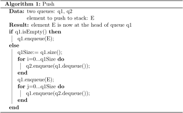
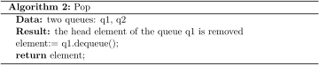

# Stack

<!-- MarkdownTOC -->

- [Basic Operations](#basic-operations)
- [Implementations](#implementations)
  - [Implementing Stack by Arrays](#implementing-stack–by-arrays)
  - [Implementing Stack by LinkedList](#implementing-stack–by-linkedlist)
- [LinkedList Class](#linkedlist-class)
  - [LinkedList vs Stack](#linkedlist-vs-stack)
  - [Stack Featured Methods](#stack-featured-ethods)
- [Applications of Stack](#applications-of-stack)
  - [Design and Implementation](#design-and-implementation)
    - [Implement Queue using Stacks](#implement-queue-using-stacks)
    - [Implement Two Stacks in One Array](#implement-two-stacks-in-one-array)
- [References](#references)

<!-- /MarkdownTOC -->

Stack is a linear data structure, which follows the operational order LIFO(Last In First Out) or FILO(First In Last Out).


## Basic Operations

- _Push_: Adds an item in the stack. If the stack is full, then it is said to be an Overflow condition. O(1)
- _Pop_: Removes an item from the stack. The items are popped in the reversed order in which they are pushed. If the stack is empty, then it is said to be an Underflow condition.
- _Peek_ or _Top_: Returns top element of stack.

Time complexity in _big-O_ notation is

| Algorithm | Average | Worst case |
|:---------:|:-------:|:----------:|
| _Push_ | _O(1)_ | _O(1)_ |
| _Pop_ | _O(1)_ | _O(1)_ |
| _Peek_ | _O(1)_ | _O(1)_ |

## Implementations

### Implementing Stack by Arrays

```java
class Stack { 
    int top, capacity;
    int[] val;

    Stack(int capacity) {
        this.top = -1;
        this.capacity = capacity;
        this.val = new int[capacity];
    }
  
    boolean isEmpty() { 
        return top < 0; 
    } 
  
    boolean push(int x) { 
        if (top >= capacity) { 
            return false; // Stack Overflow
        } 
        else { 
            val[++top] = x; 
            return true; 
        } 
    } 
  
    int pop() throws StackUnderflowException { 
        if (top < 0) { 
            throw new StackUnderflowException();
        } 
        else { 
            return val[top--]; 
        } 
    } 
  
    int peek() throws StackUnderflowException { 
        if (top < 0) { 
            throw new StackUnderflowException(); 
        } 
        else { 
            return val[top]; 
        } 
    } 
} 
```

### Implementing Stack by LinkedList

```java
// Add new node at head
public class Stack {
    StackNode root;

    static class StackNode {
        int val;
        StackNode next;

        StackNode(int val) {
            this.val = val;
        }
    }

    public boolean isEmpty() {
        if (root == null)
            return true;
        else
            return false;
    }

    public void push(int val) {
        StackNode newNode = new StackNode(val);
        if (root == null)
            root = newNode;
        else {
            StackNode temp = root;
            root = newNode;
            newNode.next = temp;
        }
    }

    public int pop() throws StackUnderflowException {
        int popped = Integer.MIN_VALUE;
        if (root == null)
           throw new StackUnderflowException();
        else {
            popped = root.val;
            root = root.next;
        }
        return popped;
    }

    public int peek() throws StackUnderflowException {
        if (root == null)
            throw new StackUnderflowException();
        else
            return root.val;
    }
}
```

## LinkedList Class

_LinkedList_ class provide the support for stack operations.

### LinkedList vs Stack

In Java, both _LinkedList_ and _Stack_ classes represents a last-in-first-out (LIFO) stack of objects. However, _Stack_ extends _Vector_ class, which is synchronized. So it has an overhead than LinkedList. Normally, most Java programmers use LinkedList instead of Vector because they can synchronize explicitly by themselves.

### Stack Featured Methods

- _E pop()_: Pops an element from the stack represented by this list.

- _void push(E e)_: Pushes an element onto the stack represented by this list.

- _E peek()_: Retrieves, but does not remove, the head (first element) of this list.

## Application of Stacks

### Design and Implementation

#### Implement Queue using Stacks

Using two stacks to accomplish it.

- enQueue operation costly

```
enQueue(q, x):
    While stack1 is not empty, push everything from stack1 to stack2.
    Push x to stack1 (assuming size of stacks is unlimited).
    Push everything back to stack1.

deQueue(q):
    If stack1 is empty then error
    Pop an item from stack1 and return it
```

- deQueue operation costly

```
enQueue(q,  x):
    Push x to stack1

deQueue(q):
    If both stacks are empty then error.
    If stack2 is empty
        While stack1 is not empty, push everything from stack1 to stack2.
    Pop the element from stack2 and return it.
```

#### Implement Stack using Queues

Using two queue to accomplish it.

- _push (E element)_
  - if _q1_ is empty, _enqueue_ _E_ to _q1_
  - if _q1_ is not empty, _enqueue_ all elements from _q1_ to _q2_, then _enqueue_ _E_ to _q1_, and _enqueue_ all elements from _q2_ back to _q1_



- _pop_
  - _dequeue_ an element from q1



#### Implement Two Stacks in One Array

Create a data structure _TwoStacks_ that represents two stacks. Implementation of _TwoStacks_ should use only one array. Following functions must be supported by _TwoStacks_,

- _push1(int x)_ –> pushes x to first stack
- _push2(int x)_ –> pushes x to second stack
- _pop1()_ –> pops an element from first stack and return the popped element
- _pop2()_ –> pops an element from second stack and return the popped element

The idea is to start two stacks from two extreme corners of arr[]. stack1 starts from the leftmost element, the first element in stack1 is pushed at index 0. The stack2 starts from the rightmost corner, the first element in stack2 is pushed at index (n-1). Both stacks grow (or shrink) in opposite direction. To check for overflow, all we need to check is for space between top elements of both stacks. This check is highlighted in the below code.

```java
class TwoStacks {
    int size;
    int top1, top2;
    int arr[];

    // Constructor
    TwoStacks(int n)
    {
        arr = new int[n];
        size = n;
        top1 = -1;
        top2 = size;
    }

    // Method to push an element x to stack1
    void push1(int x)
    {
        // There is at least one empty space for
        // new element
        if (top1 < top2 - 1) {
            top1++;
            arr[top1] = x;
        }
        else {
            System.out.println("Stack Overflow");
            System.exit(1);
        }
    }

    // Method to push an element x to stack2
    void push2(int x)
    {
        // There is at least one empty space for
        // new element
        if (top1 < top2 - 1) {
            top2--;
            arr[top2] = x;
        }
        else {
            System.out.println("Stack Overflow");
            System.exit(1);
        }
    }

    // Method to pop an element from first stack
    int pop1()
    {
        if (top1 >= 0) {
            int x = arr[top1];
            top1--;
            return x;
        }
        else {
            System.out.println("Stack Underflow");
            System.exit(1);
        }
        return 0;
    }

    // Method to pop an element from second stack
    int pop2()
    {
        if (top2 < size) {
            int x = arr[top2];
            top2++;
            return x;
        }
        else {
            System.out.println("Stack Underflow");
            System.exit(1);
        }
        return 0;
    }
}
```

## References
- <https://en.wikipedia.org/wiki/Stack_(abstract_data_type)>
- <https://www.geeksforgeeks.org/implement-two-stacks-in-an-array/>
