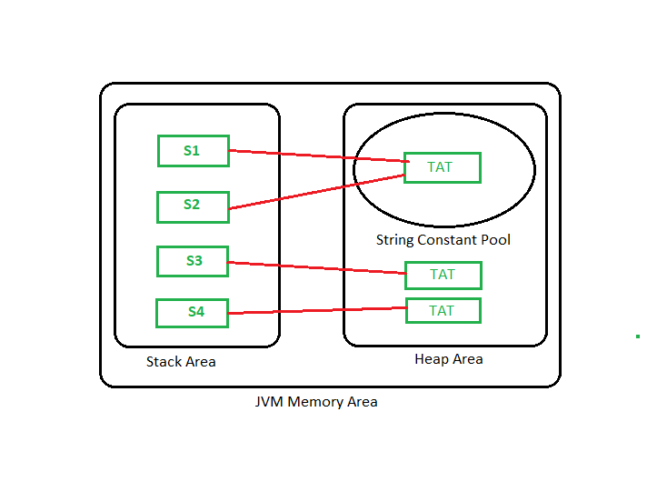

# String

A string is traditionally a sequence of characters, either as a literal constant or as some kind of variable.

<!-- MarkdownTOC -->

- [String in Java](#string-in-java)
  - [Memory allotment of String](#memory-allotment-of-string)
  - [String methods](#string-methods)
- [Classes about Strings in Java](#classes-in-strings-in-java)
  - [StringBuffer](#stringbuffer)
    - [StringBuffer Constructor](#stringbuffer-constructor)
    - [StringBuffer Methods](#stringbuffer-methods)
  - [StringBuilder](#stringbuilder)
    - [StringBuilder Constructor](#stringbuilder-constructor)
    - [StringBuilder Methods](#stringbuilder-methods)
  - [String vs StringBuffer vs StringBuilder](#string-vs-stringbuffer-vs-stringbuilder)
- [String-related Methods](#string-related-methods)
- [Things to be clarified in an interview](#things-to-be-clarified-in-interview)

<!-- /MarkdownTOC -->

## _String_ in Java

_String_ in Java is an Object that is backed internally by a char array. Since an array is immutable(cannot grow or update), _String_ is immutable as well. Whenever a change to a _String_ is made, an entirely new _String_ is created.

```java
String str1 = "LeetCode";                   // String literal
String str2 = new String("LeetCode");       // Using new keyword
```

### Memory allotment of String

As we know both Stack and Heap space is part of Java Virtual Machine (JVM). However, these memory spaces are used for different purposes. Stack space contains specific values that are short-lived whereas Heap space used by Java Runtime to allocate memory to objects and JRE classes. In Java, strings are stored in the heap area.

#### Why Java strings stored in Heap, not in Stack?

Well, String is a class, and strings in Java are treated as an object, hence the object of String class will be stored in Heap, not in the stack area. Let’s go deep into the topic. As we all know we can create a string object in two ways, i.e

- By string literal
- By using _`new`_ keyword

Here the JVM checks the String Constant Pool. If the string does not exist then a new string instance is created and placed in the pool if the string exists then it will not create a new object rather it will return the reference to the same instance. The cache that stores these string instances is known as String Constant pool or String Pool. In earlier versions of Java up to JDK 6 String pool was located inside PermGen(Permanent Generation) space. But in JDK 7 it is moved to the main heap area.

#### Why did the String pool move from PermGen to the normal heap area?

PermGen space is limited space, the default size is just 64 MB. It was a problem of creating and storing too many string objects in PermGen space. That’s why the String pool is moved to a larger heap area. To make Java more memory efficient the concept of string literal is used.

By the use of _`new`_ keyword, the JVM will create a new string object in the normal heap area even if the same string object is present in the string pool.

```java
import java.io.*;

class GFG {
    public static void main(String[] args) {
        // String created using String literal
        String s1 = "TAT";
        String s2 = "TAT";

        // String created using 'new' keyword
        String s3 = new String("TAT");
        String s4 = new String("TAT");
    }
}
```

The below figure illustrates the storage of String :



Here in the above figure, the String is stored in _String_ constant pool. String object reference variables are stored in the stack area under the method _`main()`_.

### String methods

- _int length()_: Returns the number of characters in the String.

```java
String str1 = "LeetCode";
str1.length();             // returns: 8
"LeetCode".length();       // returns: 8
```

- _boolean isEmpty()_: Returns if the length of the String is 0 or not.

```java
String str1 = "LeetCode";
str1.isEmpty();         // returns: false
"".isEmpty();           // returns: true
```

- _char charAt(int i)_: Returns the character at i-th index.

```java
"LeetCode".charAt(3);   // returns: 't'
```

- _String substring(int i)_: Return the substring stating the i-th index character to end.

```java
"LeetCode".substring(3);    // returns: "tCode"
```

- _String substring(int i, int j)_: Returns the substring from i to j-1 index (excluding j-th).

```java
"LeetCode".substring(3, 6);    // returns: "tCo"
```

- _String concat(String str)_: Concatenates specified string to the end of this string.

```java
"LeetCode".concat(" is good");    // returns: "LeetCode is good"
```

- _int indexOf(String s)_: Returns the index within the string of the first occurrence of the specified string, -1 if it does not exist.

```java
"LeetCode".indexOf("Code");    // returns: 4
"LeetCode".indexOf("code");    // returns: -1
```

- _int indexOf(String s, int i)_: Returns the index within the string of the first occurrence of the specified string, starting at the i-th index.

```java
"LeetCode".indexOf("Code", 3);    // returns: 4
"LeetCode".indexOf("Code", 5);    // returns: -1
```

- _Int lastIndexOf(String s)_: Returns the index within the string of the last occurrence of the specified string.

```java
"LeetCodeCode".lastIndexOf("Code", 3);    // returns: 8
```

- _boolean equals(Object otherObj)_: Compares this string to the specified object.

```java
"LeetCode".equals("LeetCode");    // returns: true
"LeetCode".equals("leetcode");    // returns: false
```

- _boolean  equalsIgnoreCase(String anotherString)_: Compares string to another string, ignoring case considerations.

```java
"LeetCode".equalsIgnoreCase("leetcode");    // returns: true
```

- _int compareTo(String anotherString)_: Compares two string lexicographically.

```java
int out = s1.compareTo(s2);
//  This returns difference s1-s2. If :
//  out < 0  // s1 comes before s2
//  out = 0  // s1 and s2 are equal.
//  out > 0   // s1 comes after s2
```

- _String toLowerCase()_: Converts all the characters in the String to lower case.

```java
"LeetCode".toLowerCase();    // returns: "leetcode"
```

- _String toUpperCase()_: Converts all the characters in the String to upper case.

```java
"LeetCode".toUpperCase();    // returns: "LEETCODE"
```

- _String trim()_: Returns the copy of the String, by removing white spaces at both ends. It does not affect white spaces in the middle.

```java
"  Leet  Code   ".trim();    // returns: "Leet  Code"
```

- _String replace(char oldChar, char newChar)_: Returns new string by replacing all occurrences of oldChar with newChar.

```java
"LeetCode".replace('e', 'f');    // returns: "LfftCodf"
```

- _boolean endsWith(String suffix)_: Returns if the String has same suffix.

```java
"LeetCode".endsWith("Code");    // returns: true
"LeetCode".endsWith("code");    // returns: false
```

- _boolean startsWith(String prefix)_: Returns if the String has same prefix.

```java
"LeetCode".startsWith("Leet");    // returns: true
"LeetCode".startsWith("leet");    // returns: false
```

- _char[] toCharArray()_: Returns the character array of the string.

```java
char[] charArray = "LeetCode".toCharArray();    // returns: {'L', 'e', 'e', 't', 'C', 'o', 'd', 'e'}
```

- _int codePointAt(int i)_: Returns the _unicode_ of character at i-th index.

```java
"LeetCode".codePointAt(1);      // returns: 101
```

- _String[] split(String reg_exp)_: Returns a String array by splitting the string around the regular expression. (Usually split by white spaces)

```java
"Leet Code".split(" ");      // returns: {"Leet", "Code"}
"Leet  Code".split(" ");     // returns: {"Leet", "", "Code"}
```

- _String replaceAll(String reg_exp, String replacement)_: Returns the new modified String by replacing all the Substring of the original string that matches the reg_exp with replacement String.

```java
"Leet Code Code".replaceAll("Code", "cool");      // returns: {"Leet cool cool"}
```

- _String replaceFirst(String reg_exp, String replacement)_: Returns the new modified String by replacing the first Substring of the original string that matches the reg_exp with replacement String.

```java
"Leet Code Code".replaceFirst("Code", "cool");      // returns: {"Leet cool Code"}
```

## Classes about Strings in Java

### StringBuffer

_StringBuffer_ is a peer class of String that provides much of the functionality of strings. It provides growable and writable character sequences, while _String_ is immutable.

_StringBuffer_ can automatically grow or shrink to allow operations, such as inserting, deleting or appending.

#### StringBuffer Constructor

```java
// reserves room for 16 characters w/o reallocation as default
StringBuffer s=new StringBuffer();
// reserves room for 20 characters w/o reallocation
StringBuffer s=new StringBuffer(20);
// a String argument that sets the initial contents of the StringBuffer object.
// Reserve room for 16 more characters w/o reallocation.
StringBuffer s=new StringBuffer("LeetCode");
```

#### StringBuffer Methods

- _int length()_: returns the length of characters.

```java
StringBuffer s = new StringBuffer("LeetCode");
s.length();     // returns 8
```

- _int capacity()_: returns the length of reserved room.

```java
StringBuffer s = new StringBuffer("LeetCode");
s.capacity();     // returns 24
```

- _StringBuffer append()_: returns the reference to this updated object.

```java
StringBuffer s = new StringBuffer("LeetCode");
s.append(" is good!");  // s contains "LeetCode is good!"
```

- _StringBuffer insert(int offset, String str)_: returns a reference to this updated object (the same as _StringBuffer insert(int index, char ch)_).

```java
StringBuffer s = new StringBuffer("LeetCode");
s.insert(4, " is good ");  // s contains "Leet is good Code"
```

- _StringBuffer delete(int start, int end)_: returns a reference to this updated object.

```java
StringBuffer s = new StringBuffer("LeetCode");
s.delete(4, 6);  // s contains "Leetde"
```

- _StringBuffer deleteCharAt(int index)_: return a reference to this updated object

```java
StringBuffer s = new StringBuffer("LeetCode");
s.deleteCharAt(4);  // s contains "Leetode"
```

- _StringBuffer replace(int start, int end, String str)_: replaces the characters in a substring of this sequence with characters in the specified String.

```java
StringBuffer s = new StringBuffer("LeetCode");
s.replace(1, 7, "cool");  // s contains "Lcoole"
```

- _StringBuffer reverse()_: causes this character sequence to be replaced by the reverse of the sequence.

```java
StringBuffer s = new StringBuffer("LeetCode");
s.reverse();  // s contains "edoCteeL"
```

- _char charAt(int i)_: returns the character at i-th index.

```java
StringBuffer s = new StringBuffer("LeetCode");
s.charAt(4);  // returns 'C'
```

- _int indexOf(String str)_: returns the index within the string of the first occurrence of the specified string, -1 if it does not exist.

```java
StringBuffer s = new StringBuffer("LeetCode");
s.indexOf("Code");    // returns: 4
s.indexOf("code");    // returns: -1
```

- _int lastIndexOf(String str)_: returns the index within this string of the last occurrence of the specified substring.

```java
StringBuffer s = new StringBuffer("LeetCodeCode");
s.indexOf("Code");    // returns: 8
```

- _void setCharAt(int i, char ch)_: set the character at the i-th index to ch.

```java
StringBuffer s = new StringBuffer("LeetCode");
s.setCharAt(4, 'L');    // s contains "LeetLode"
```

- _String substring(int start)_ and _String substring(int start, int end)_: returns a new String that contains a subsequence of characters currently contained in this character sequence.

```java
StringBuffer s = new StringBuffer("LeetCode");
s.substring(4);       // returns "Code"
s.substring(4, 6);    // returns "Co"
```

### StringBuilder

The StringBuilder in Java represents a mutable sequence of characters, which provides an alternative to String Class, as it creates a mutable sequence of characters. The function of StringBuilder is very similar to the StringBuffer class, as both of them provide an alternative to String Class by making a mutable sequence of characters.

The difference will be introduced in the next section.

#### StringBuilder Constructor

```java
// reserves room for 16 characters w/o reallocation as default
StringBuilder s=new StringBuilder();
// reserves room for 20 characters w/o reallocation
StringBuilder s=new StringBuilder(20);
// a String argument that sets the initial contents of the StringBuffer object.
// Reserve room for 16 more characters w/o reallocation.
StringBuilder s=new StringBuilder("LeetCode");
```

#### StringBuilder Methods

The methods of StringBuffer are mostly the same as StringBuffer.

### String vs StringBuffer vs StringBuilder

| Name | Immutable | Synchronized | Performance |
|:----:|:---------:|:------------:|:-----------:|
| String | Yes | String pool is visible to all threads using literal | Very fast |
| StringBuilder | Not | Not | Fast |
| StringBuffer | Not | Yes | Slow |

## String-related Methods

- _Integer.parseInt()_: returns decimal integer by parsing the string argument

```java
Integer.parseInt("52");     // returns 52
```

## Things to be clarified in an interview

- Is the input string always valid?
  The object can be `null` or empty. Please do the sanity check first.

- Does string only contain letters? both upper and lower cases?
  Since there are only 26 letters in English, loop the count is constant time.

## Reference

- <https://docs.oracle.com/javase/7/docs/api/java/lang/StringBuffer.html>
- <https://www.geeksforgeeks.org/storage-of-string-in-java/>
