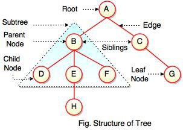

# Tree

<!-- MarkdownTOC -->

- [Definition](#definition)
- [Important Terms](#important-terms)
- [Binary Tree](#binary-search-tree)
  - [Properties of Binary Tree](#properties-of-binary-tree)
  - [Types of Binary Tree](#types-of-binary-tree)
  - [Traversal](#traversal)
  - [Binary Search Tree](#binary-search-tree)
    - [Search](#search)
    - [Insert](#insert)
    - [Delete](#delete)
- [Segment Tree](#segment-tree)
- [Trie](#trie)
- [References](#references)

<!-- /MarkdownTOC -->

## Definition

A tree data structure is represented as a root value and subtrees of children with a parent node, as a set of linked nodes. It can be defined recursively as a collection of nodes (starting at a root node), where each node is a data structure consisting of a value, together with a list of references to nodes (the "children"), with the constraints that no reference is duplicated, and none points to the root.

Unlike Arrays, Linked Lists, Stack and queues, which are linear data structures, trees are **hierarchical** data structures.



```java
public class Tree<T> {
    private Node<T> root;

    public Tree(T rootData) {
        root = new Node<T>();
        root.data = rootData;
        root.children = new ArrayList<Node<T>>();
    }

    public static class Node<T> {
        private T data;
        private Node<T> parent;
        private List<Node<T>> children;
    }
}
```

## Important Terms

Following are the important terms with respect to tree.

- _Path_: Path refers to the sequence of nodes along the edges of a tree.
- _Root_: The node at the top of the tree is called root. There is only one root per tree and one path from the root node to any node.
- _Parent_: Any node except the root node has one edge upward to a node called parent.
- _Child_: The node below a given node connected by its edge downward is called its child node.
- _Leaf_: The node which does not have any child node is called the leaf node.
- _Subtree_: Subtree represents the descendants of a node.
- _Visiting_: Visiting refers to checking the value of a node when control is on the node.
- _Traversing_: Traversing means passing through nodes in a specific order.
- _Levels_: Level of a node represents the generation of a node. If the root node is at level 0, then its next child node is at level 1, its grandchild is at level 2, and so on.
- _keys_: Key represents a value of a node based on which a search operation is to be carried out for a node.

## Binary Tree


A binary tree is a tree data structure in which each node has at most two children, which are referred to as the left child and the right child.

```java
class Node 
{ 
    int key; 
    Node left, right; 
  
    public Node(int item) 
    { 
        key = item; 
        left = right = null; 
    } 
}
```

### Properties of Binary Tree

- The maximum number of nodes at level _i-th_ of a binary tree is _2^(l-1)_.

- Maximum number of nodes in a binary tree of height _h_ is _2^h – 1_.

- In a Binary Tree with _N_ nodes, minimum possible height or minimum number of levels is _Log2(N+1)_.

- A Binary Tree with L leaves has at least _Log2L+1_ levels.

- n Binary tree where every node has 0 or 2 children (full binary tree), number of leaf nodes is always one more than nodes with two children.

### Types of Binary Tree

- Full Binary Tree: A Binary Tree is full if every node has 0 or 2 children. We can also say a full binary tree is a binary tree in which all nodes except leaves have two children.

- Complete Binary Tree: A Binary Tree is complete Binary Tree if all levels are completely filled except possibly the last level and the last level has all keys as left as possible.

- Perfect Binary Tree: A Binary tree is Perfect Binary Tree in which all internal nodes have two children and all leaves are at the same level.A Perfect Binary Tree of height h (where height is the number of nodes on the path from the root to leaf) has _2^h – 1_ node.

- Balanced Binary Tree: A binary tree is balanced if the height of the tree is _O(Log n)_ where n is the number of nodes.

- A degenerate (or pathological) tree: A Tree where every internal node has one child. Such trees are performance-wise same as linked list.

### Traversal

#### Inorder Traversal

```
Algorithm Inorder(tree)
   1. Traverse the left subtree, i.e., call Inorder(left-subtree)
   2. Visit the root.
   3. Traverse the right subtree, i.e., call Inorder(right-subtree)
```

#### Preorder Traversal

```
Algorithm Preorder(tree)
   1. Visit the root.
   2. Traverse the left subtree, i.e., call Preorder(left-subtree)
   3. Traverse the right subtree, i.e., call Preorder(right-subtree) 
```

#### Postorder Traversal

```
Algorithm Postorder(tree)
   1. Traverse the left subtree, i.e., call Postorder(left-subtree)
   2. Traverse the right subtree, i.e., call Postorder(right-subtree)
   3. Visit the root.
```

### Binary Search Tree

Binary search tree (BST) is a binary tree data structure which has the following properties:

- The left subtree of a node contains only nodes with keys lesser than the node’s key.
- The right subtree of a node contains only nodes with keys greater than the node’s key.
- The left and right subtree each must also be a binary search tree.


### Time Complexity

| Algorithm | Average | Worst case |
| :-------: | :-----: | :--------: |
| Space	|	_O(n)_ | _O(n)_ |
| Search	|	_O(log n)_ | _O(n)_ |
| Insert	|	_O(log n)_ | _O(n)_ |
| Delete	|	_O(log n)_ | _O(n)_ |

#### Search

```java
public Node search(Node root, int key) {
    // Base Cases: root is null or key is present at root
    if (root==null || root.key==key)
        return root;
    // val is greater than root's key 
    else if (root.key > key)
        return search(root.left, key);
    // val is less than root's key
    else
      return search(root.right, key);
}
```

#### Insert

```java      
/* A recursive function to insert a new key in BST */
Node insert(Node root, int key) { 

    /* If the tree is empty, return a new node */
    if (root == null) { 
        root = new Node(key); 
        return root; 
    } 

    /* Otherwise, recur down the tree */
    if (key < root.key) 
        root.left = insertRec(root.left, key); 
    else if (key > root.key) 
        root.right = insertRec(root.right, key); 

    /* return the (unchanged) node pointer */
    return root; 
} 
```

#### Delete


#### Verify

```java

```

## Segment Tree

## Trie

## References
- <https://en.wikipedia.org/wiki/Tree_(data_structure)>
- <https://en.wikipedia.org/wiki/Binary_tree>
