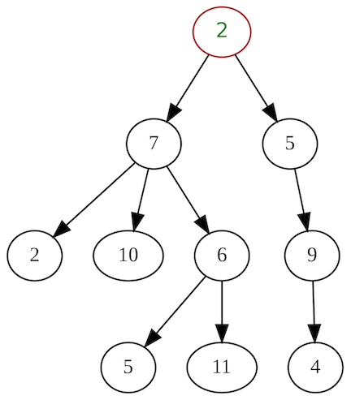
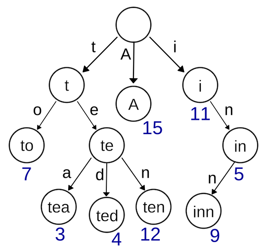
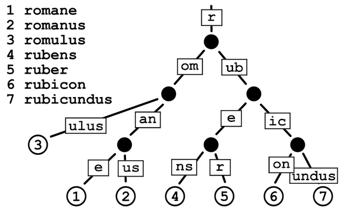
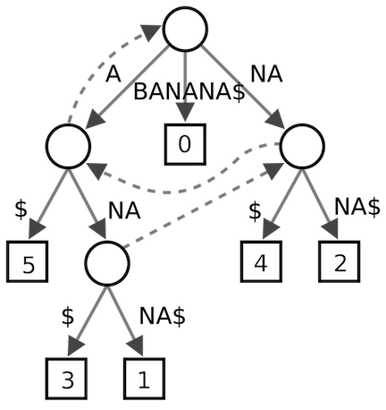

# Tree

<!-- MarkdownTOC -->

- [Definition](#definition)
- [Important Terms](#important-terms)
- [Binary Tree](#binary-search-tree)
  - [Properties of Binary Tree](#properties-of-binary-tree)
  - [Types of Binary Tree](#types-of-binary-tree)
  - [Traversal](#traversal)
  - [Binary Search Tree](#binary-search-tree)
    - [Search](#search)
    - [Insert](#insert)
    - [Delete](#delete)
    - [Application of BST](#application-of-bst)
      - [Serialize and Deserialize](#serialize-and-deserialize)
      - [Find k-th Smallest Element in BST](#Find-k-th-smallest-element-in-bst)
- [Segment Tree](#segment-tree)
  - [Construct Segment Tree](#construct-segment-tree)
  - [Query a Sum of Given Range](#query-a-sum-of-given-range)
  - [Update a Value](#update-a-value)
- [Trie](##trie-prefix-tree)
  - [Trie Node](#trie-node)
  - [Insert](#insert-1)
  - [Search](#search-1)
  - [Radix Tree](#radix-tree)
- [Suffix Tree](#suffix-tree)
- [References](#references)

<!-- /MarkdownTOC -->

## Definition

A tree data structure is represented as a root value and subtrees of children with a parent node, as a set of linked nodes. It can be defined recursively as a collection of nodes (starting at a root node), where each node is a data structure consisting of a value, together with a list of references to nodes (the "children"), with the constraints that no reference is duplicated, and none points to the root.

Unlike Arrays, Linked Lists, Stack and queues, which are linear data structures, trees are **hierarchical** data structures.



```java
public class Tree<T> {
    private Node<T> root;

    public Tree(T rootData) {
        root = new Node<T>();
        root.data = rootData;
        root.children = new ArrayList<Node<T>>();
    }

    public static class Node<T> {
        private T data;
        private Node<T> parent;
        private List<Node<T>> children;
    }
}
```

## Important Terms

Following are the important terms with respect to tree.

- _Path_: Path refers to the sequence of nodes along the edges of a tree.
- _Root_: The node at the top of the tree is called root. There is only one root per tree and one path from the root node to any node.
- _Parent_: Any node except the root node has one edge upward to a node called parent.
- _Child_: The node below a given node connected by its edge downward is called its child node.
- _Leaf_: The node which does not have any child node is called the leaf node.
- _Subtree_: Subtree represents the descendants of a node.
- _Visiting_: Visiting refers to checking the value of a node when control is on the node.
- _Traversing_: Traversing means passing through nodes in a specific order.
- _Levels_: Level of a node represents the generation of a node. If the root node is at level 0, then its next child node is at level 1, its grandchild is at level 2, and so on.
- _keys_: Key represents a value of a node based on which a search operation is to be carried out for a node.

## Binary Tree


A binary tree is a tree data structure in which each node has at most two children, which are referred to as the left child and the right child.

```java
class Node {
    int key;
    Node left, right;
  
    public Node(int item) {
        key = item;
        left = right = null;
    }
}
```

### Properties of Binary Tree

- The maximum number of nodes at level _i-th_ of a binary tree is _2^(l-1)_.

- Maximum number of nodes in a binary tree of height _h_ is _2^h – 1_.

- In a Binary Tree with _N_ nodes, minimum possible height or minimum number of levels is _Log2(N+1)_.

- A Binary Tree with L leaves has at least _Log2L+1_ levels.

- n Binary tree where every node has 0 or 2 children (full binary tree), number of leaf nodes is always one more than nodes with two children.

### Types of Binary Tree

- Full Binary Tree: A Binary Tree is full if every node has 0 or 2 children. We can also say a full binary tree is a binary tree in which all nodes except leaves have two children.

- Complete Binary Tree: A Binary Tree is complete Binary Tree if all levels are completely filled except possibly the last level and the last level has all keys as left as possible.

- Perfect Binary Tree: A Binary tree is Perfect Binary Tree in which all internal nodes have two children and all leaves are at the same level. A Perfect Binary Tree of height h (where height is the number of nodes on the path from the root to leaf) has _2^h – 1_ node.

- Balanced Binary Tree: A binary tree is balanced if the height of the tree is _O(Log n)_ where n is the number of nodes.

- A degenerate (or pathological) tree: A Tree where every internal node has one child. Such trees are performance-wise same as linked list.

### Traversal

#### Inorder Traversal

```
Algorithm Inorder(tree)
   1. Traverse the left subtree, i.e., call Inorder(left-subtree)
   2. Visit the root.
   3. Traverse the right subtree, i.e., call Inorder(right-subtree)
```

#### Preorder Traversal

```
Algorithm Preorder(tree)
   1. Visit the root.
   2. Traverse the left subtree, i.e., call Preorder(left-subtree)
   3. Traverse the right subtree, i.e., call Preorder(right-subtree) 
```

#### Postorder Traversal

```
Algorithm Postorder(tree)
   1. Traverse the left subtree, i.e., call Postorder(left-subtree)
   2. Traverse the right subtree, i.e., call Postorder(right-subtree)
   3. Visit the root.
```

### Binary Search Tree

Binary search tree (BST) is a binary tree data structure which has the following properties:

- The left subtree of a node contains only nodes with keys lesser than the node’s key.
- The right subtree of a node contains only nodes with keys greater than the node’s key.
- The left and right subtree each must also be a binary search tree.


The class implementation is [here](https://algs4.cs.princeton.edu/32bst/BST.java.html)

### Time Complexity

| Algorithm | Average | Worst case |
| :-------: | :-----: | :--------: |
| Space | _O(n)_ | _O(n)_ |
| Search | _O(log n)_ | _O(n)_ |
| Insert | _O(log n)_ | _O(n)_ |
| Delete | _O(log n)_ | _O(n)_ |

#### Search

```java
public Node search(Node root, int key) {
    // Base Cases: root is null or key is present at root
    if (root==null || root.key==key)
        return root;
    // val is greater than root's key 
    else if (root.key > key)
        return search(root.left, key);
    // val is less than root's key
    else
      return search(root.right, key);
}
```

#### Insert

```java      
/* A recursive function to insert a new key in BST */
Node insert(Node root, int key) { 
    /* If the tree is empty, return a new node */
    if (root == null) { 
        root = new Node(key); 
        return root; 
    } 
    /* Otherwise, recur down the tree */
    if (key < root.key) 
        root.left = insertRec(root.left, key); 
    else if (key > root.key) 
        root.right = insertRec(root.right, key); 

    /* return the (unchanged) node pointer */
    return root; 
} 
```

#### Delete

```python
def find_min(self):
    """Get minimum node in a subtree."""
    current_node = self
    while current_node.left_child:
        current_node = current_node.left_child
    return current_node

def replace_node_in_parent(self, new_value=None) -> None:
    if self.parent:
        if self == self.parent.left_child:
            self.parent.left_child = new_value
        else:
            self.parent.right_child = new_value
    if new_value:
        new_value.parent = self.parent

def binary_tree_delete(self, key) -> None:
    if key < self.key:
        self.left_child.binary_tree_delete(key)
        return
    if key > self.key:
        self.right_child.binary_tree_delete(key)
        return
    # Delete the key here
    if self.left_child and self.right_child:  # If both children are present
        successor = self.right_child.find_min()
        self.key = successor.key
        successor.binary_tree_delete(successor.key)
    elif self.left_child:  # If the node has only a *left* child
        self.replace_node_in_parent(self.left_child)
    elif self.right_child:  # If the node has only a *right* child
        self.replace_node_in_parent(self.right_child)
    else:
        self.replace_node_in_parent(None)  # This node has no children
```

#### Verify

```java
boolean isBST(Node root) {
  return isBST(root, Integer.MAX_VALUE, Integer.MIN_VALUE);
}

boolean isBST(Node root, int max, int min) {
  if (root == null) return true;
  return root.val <= max && root.val >= min && isBST(root.left, root.val, min) && isBST(root.right, max, root.val);
}
```

#### Application of BST

#### Serialize and Deserialize

LeetCode [297](https://leetcode.com/problems/serialize-and-deserialize-binary-tree/).

```java
public class BinaryTree {
    private static final String delimiter = ",";
    private static final String NULL = "X";

    // Encodes a tree to a single string.
    public String serialize(TreeNode root) {
        StringBuilder sb = new StringBuilder();
        serializeRec(root, sb);
        return sb.toString();
    }
    
    private void serializeRec(TreeNode root, StringBuilder sb) {
        if (root == null)
            sb.append(NULL).append(delimiter);
        else {
            sb.append(root.val).append(delimiter);
            serializeRec(root.left, sb);
            serializeRec(root.right, sb);
        }
    } 

    // Decodes your encoded data to tree.
    public TreeNode deserialize(String data) {
        LinkedList<String> queue = new LinkedList<>();
        queue.addAll(Arrays.asList(data.split(delimiter)));
        return deserializeRec(queue);
    }
    
    private TreeNode deserializeRec(LinkedList<String> queue) {
        String val = queue.poll();
        if (val.equals(NULL))
            return null;
        else {
            TreeNode node = new TreeNode(Integer.valueOf(val));
            node.left = deserializeRec(queue);
            node.right = deserializeRec(queue);
            return node;
        }
    }
}
```

##### Find k-th Smallest Element in BST

Solution #1: use stack. The time complexity is O(k). (LeetCode [230](https://leetcode.com/problems/kth-smallest-element-in-a-bst/))

```java
public int kthSmallest(TreeNode root, int k) {
    LinkedList<TreeNode> stack = new LinkedList<>();
    int count = 0;
    
    while(root != null) {
        stack.push(root);
        root = root.left;
    }
    
    while(!stack.isEmpty()) {
        TreeNode node = stack.pop();
        if (++count == k)   return node.val;
        
        if (node.right != null) {
            node = node.right;
            while(node != null) {
                stack.push(node);
                node = node.left;
            }
        }
    }
    return -1;
}
```

## Segment Tree

Representation of Segment trees

- Leaf Nodes are the elements of the input array.
- Each internal node represents some merging of the leaf nodes. The merging may be different for different problems. For this problem, merging is sum of leaves under a node.


The full class implementation is [here](https://github.com/zorrowang/LeetCode/blob/master/src/java/lib/SegmentTree.java)

### Construct Segment Tree

The time complexity of building s segment tree is _O(n)_.

```java
Node build(int[] nums) {
    return buildRec(nums, 0, nums.length - 1);
}

Node buildRec(int[] nums, int i, int j) {
    if (i == j) 
        return new Node(nums[i]);

    int mid = (i + j) / 2;
    Node left = buildRec(nums, i, mid);
    Node right = buildRec(nums, mid+1, j);

    Node root = new Node(left.val + right.val);
    root.left = left;
    root.right = right;

    return root;
}
```

### Query a Sum of Given Range

```java
int sum(int left, int right) {
    return sumRec(this.root, left, right);
}

private int sumRec(Node cur, int left, int right) {
    if (cur.rangeLeft >= left && cur.rangeRight <= right)
        return cur.val;
    if (right < cur.rangeLeft || left > cur.rangeRight)
        return 0;
    return sumRec(cur.left, left, right) + sumRec(cur.right, left, right);
}
```

### Update a Value

```java
void update(int val, int pos) {
    update(root, val, pos);
}

private void update(Node node, int val, int pos) {
    if (node.rangeLeft == pos && node.rangeRight == pos) {
        node.val = val;
        return;
    }

    int mid = (node.rangeLeft + node.rangeRight) / 2;
    if (pos <= mid)
        update(node.left, val, pos);
    else 
        update(node.right, val, pos);
    
    node.val = node.left.val + node.right.val;
}
```

*Note*: segment tree is usually represented by array. In order to display tree-based features here, I choose to use native tree structure.

## Trie (Prefix Tree)

Trie, also called digital tree or prefix tree, is a kind of search tree—an ordered tree data structure used to store a dynamic set or associative array where the keys are usually strings. 

Using Trie, search complexities can be brought to optimal limit (key length). However the penalty is on Trie storage requirements.



### Trie Node

```java
class TrieNode {
    char val;
    TrieNode[] children;
    boolean isLeaf;

    TrieNode(char ch) {
        val = ch;
        children = new TrieNode[26];
    }

    TrieNode(char ch, boolean isWord) {
        this(ch);
        isLeaf = isWord;
    }
}
```

### Insert

```java
void insert(String word) {
    word = word.toLowerCase();
    TrieNode cur = root;

    for (int i=0; i<word.length(); i++) {
        char ch = word.charAt(i);
        if (cur.children[ch - 'a'] == null) {
            TrieNode node = new TrieNode(ch);
            cur.children[ch-'a'] = node;
        }
        cur = cur.children[ch-'a'];
    }

    cur.isLeaf = true;
}
```

### Search

```java
boolean search(String word) {
    word = word.toLowerCase();
    TrieNode cur = root;

    for (int i=0; i<word.length(); i++) {
        char ch = word.charAt(i);
        if (cur.children[ch - 'a'] == null)
            return false;
        cur = cur.children[ch-'a'];
    }
    return cur.isLeaf;
}
```

### Radix Tree

Radix tree (also radix trie or compact prefix tree) is a data structure that represents a space-optimized trie (prefix tree) in which each node that is the only child is merged with its parent.



## Suffix Tree

Suffix tree (also called PAT tree or, in an earlier form, position tree) is a compressed trie containing all the suffixes of the given text as their keys and positions in the text as their values. Suffix trees allow particularly fast implementations of many important string operations.



## References
- <https://en.wikipedia.org/wiki/Tree_(data_structure)>
- <https://en.wikipedia.org/wiki/Binary_tree>
- <https://en.wikipedia.org/wiki/Binary_search_tree>
- <https://en.wikipedia.org/wiki/Segment_tree>
- <https://en.wikipedia.org/wiki/Trie>
- <https://en.wikipedia.org/wiki/Suffix_tree>
