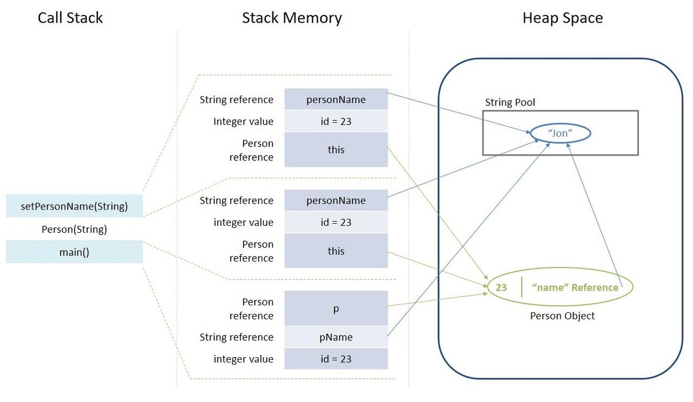

# Java Virtual Machine (JVM) & its Architecture

<!-- MarkdownTOC -->

- [What is JVM](#what-is-jvm)
- [JVM Architecture](#jvm-architecture)
  - [ClassLoader](#classloader)
    - [Built-in Class Loaders](#built-in-class-loaders)
    - [How Class Loader Works](#How-class-loader-works)
  - [Method Area](#method-area)
  - [Heap Area](#heap-area)
    - [Key Features of Java Heap Memory](#key-features-of-heap-memory)
  - [Stack Area](#stack-area)
    - [Key Features of Java Stack Memory](#key-features-of-stack-memory)
    - [Stack and Heap in Example](#stack-and-heap-in-example)
    - [Stack vs Heap](#stack-vs-heap)
- [References](#references)

<!-- /MarkdownTOC -->

## What is JVM

**Java Virtual Machine (JVM)** is a engine that provides runtime environment to drive the Java Code or applications. It converts Java bytecode into machines language. JVM is a part of Java Run Environment (JRE). In other programming languages, the compiler produces machine code for a particular system. However, Java compiler produces code for a Virtual Machine known as Java Virtual Machine.


Java code is complied into bytecode. This bytecode gets interpreted on different machines. Between host system and Java source, Bytecode is an intermediary language. JVM is also responsible for allocating memory space.

## JVM Architecture


### ClassLoader

The class loader is a subsystem used for loading Java classes during runtime dynamically to the JVM. It performs three major functions viz. Loading, Linking, and Initialization. It is part of the JRE (Java Runtime Environment). Hence, JVM doesn't need to know about the underlying files or file systems in order to run Java programs thanks to class loaders.

#### Built-in Class Loaders

```java
public void printClassLoaders() {
    System.out.println("Class loader of this class:" +
        App.class.getClassLoader());

    System.out.println("Class loader of parent class:" +
        ClassLoader.getSystemClassLoader().getParent());

    System.out.println("Class loader of ArrayList:" +
        ArrayList.class.getClassLoader());
}
```

When executed the above method prints:

```bash
Class loader of this class:sun.misc.Launcher$AppClassLoader@18b4aac2
Class loader of this class:sun.misc.Launcher$ExtClassLoader@5e91993f
Class loader of ArrayList:null
```

As we can see, there are three different class loaders here: **application**, **extension**, and **bootstrap** (displayed as null).

The application class loader loads the class where the example method is contained. `An application or system class loader loads our own files in the classpath.`

Next, the extension one loads the Logging class. `Extension class loaders load classes that are an extension of the standard core Java classes.`

Finally, the bootstrap one loads the ArrayList class. `A bootstrap or primordial class loader is the parent of all the others.`

- **Bootstrap Class Loader**: Java classes are loaded by an instance of _java.lang.ClassLoader_. While, bootstrap class loader loads _java.lang.ClassLoader_. It's mainly responsible for loading JDK internal classes, typically _rt.jar_ and other core libraries located in *$JAVA_HOME/jre/lib* directory. Additionally, Bootstrap class loader serves as a parent of all the other ClassLoader instances. This bootstrap class loader is part of the core JVM and is written in native code as pointed out in the above example. Different platforms might have different implementations of this particular class loader.

- **Extension Class Loader**: The extension class loader is a child of the bootstrap class loader and takes care of loading the extensions of the standard core Java classes so that it's available to all applications running on the platform. Extension class loader loads from the JDK extensions directory, usually *$JAVA_HOME/lib/ext* directory or any other directory mentioned in the *java.ext.dirs* system property.

- **Application Class Loader**: The application or system class loader, on the other hand, takes care of loading all the application level classes into the JVM. It loads files found in the classpath environment variable, `-classpath` or `-cp` command line option. Also, it's a child of Extensions class loader.

#### How Class Loader Works

Class loaders are part of the Java Runtime Environment. When the JVM requests a class, the class loader tries to locate the class and load the class definition into the runtime using the fully qualified class name.

The _java.lang.ClassLoader.loadClass()_ method is responsible for loading the class definition into runtime. It tries to load the class based on a fully qualified name. If the class isn't already loaded, it delegates the request to the parent class loader. This process happens recursively.

Eventually, if the parent class loader doesn’t find the class, then the child class will call _java.net.URLClassLoader.findClass()_ method to look for classes in the file system itself. If the last child class loader isn't able to load the class either, it throws _java.lang.NoClassDefFoundError_ or _java.lang.ClassNotFoundException_.

Let's look at an example of output when ClassNotFoundException is thrown.

```bash
java.lang.ClassNotFoundException: com.baeldung.classloader.SampleClassLoader
    at java.net.URLClassLoader.findClass(URLClassLoader.java:381)
    at java.lang.ClassLoader.loadClass(ClassLoader.java:424)
    at java.lang.ClassLoader.loadClass(ClassLoader.java:357)
    at java.lang.Class.forName0(Native Method)
    at java.lang.Class.forName(Class.java:348)
```

If we go through the sequence of events right from calling _java.lang.Class.forName()_, we can understand that it first tries to load the class through parent class loader and then _java.net.URLClassLoader.findClass()_ to look for the class itself. When it still doesn't find the class, it throws a _ClassNotFoundException_.

### Method Area

Method area in JVM stores class structures like metadata, the constant runtime pool, and the code for methods. It is accessible to all threads.

The method area gets created during JVM start-up. It could be of fixed size or vary. Its memory may not be contiguous. JVM implementation can give control to programmer over Method area creation, its sizing etc. If method area memory is not sufficient to satisfy an allocation request then JVM throws _java.lang.OutOfMemoryError_.

### Heap Area

Heap area in JVM is used for dynamic memory allocation for Java objects and JRE classes at the runtime. New objects are always created in heap space and the references to this objects are stored in stack memory.

This memory model is further broken into smaller parts called generations, these are:

- _Young Generation_ – this is where all new objects are allocated and aged. A minor Garbage collection occurs when this fills up.
- _Old or Tenured Generation_ – this is where long surviving objects are stored. When objects are stored in the Young Generation, a threshold for the object's age is set and when that threshold is reached, the object is moved to the old generation.
- _Permanent Generation_ – this consists of JVM metadata for the runtime classes and application methods.

#### Key Features of Heap Memory

- It's accessed via complex memory management techniques that include Young Generation, Old or Tenured Generation, and Permanent Generation.
- If heap space is full, Java throws _java.lang.OutOfMemoryError_.
- Access to this memory is relatively slower than stack memory.
- This memory, in contrast to stack, isn't automatically de-allocated. It needs Garbage Collector to free up unused objects so as to keep the efficiency of the memory usage.
- Unlike stack, a heap isn't thread-safe and needs to be guarded by properly synchronizing the code.

### Stack Area

Stack area in JVM is used for static memory allocation and the execution of a thread. It contains primitive values that are specific to a method and references to objects that are in a heap, referred from the method.

Access to this memory is in Last-In-First-Out (LIFO) order. Whenever a new method is called, a new block on top of the stack is created which contains values specific to that method, like primitive variables and references to objects.

When the method finishes execution, it’s corresponding stack frame is flushed, the flow goes back to the calling method and space becomes available for the next method.

#### Key Features of Stack Memory

- It grows and shrinks as new methods are called and returned respectively.
- Variables inside stack exist only as long as the method that created them is running.
- It's automatically allocated and de-allocated when method finishes execution.
- If this memory is full, Java throws _java.lang.StackOverFlowError_.
- Access to this memory is fast when compared to heap memory.
- This memory is thread-safe as each thread operates in its own stack.

#### Stack and Heap in Example

```java
class Person {
    int pid;
    String name;

    Person(int pid, String name) {
        this.pid = pid;
        this.name = name;
    }
}

public class Driver {
    public static void main(String[] args) {
        int id = 23;
        String pName = "Jon";
        Person p = null;
        p = new Person(id, pName);
    }
}
```

Let's analyze this step by step:

- Upon entering the main() method, a space in stack memory would be created to store primitives and references of this method
  - The primitive value of integer _id_ will be stored directly in stack memory
  - The reference variable _p_ of type Person will also be created in stack memory which will point to the actual object in the heap
- The call to the parameterized constructor _Person(int, String)_ from _main()_ will allocate further memory on top of the previous stack. This will store:
  - The this object reference of the calling object in stack memory
  - The primitive value _id_ in the stack memory
  - The reference variable of _String_ argument _personName_ which will point to the actual string from string pool in heap memory
- This default constructor is further calling _setPersonName()_ method, for which further allocation will take place in stack memory on top of previous one. This will again store variables in the manner described above.
- However, for the newly created object _p_ of type Person, all instance variables will be stored in heap memory.

This allocation is explained in this diagram:



#### Stack vs Heap

| Parameter | Stack Area | Heap Area |
|:---------:|:----------:|:---------:|
| Application | Stack is used in parts, one at a time during execution of a thread | The entire application uses Heap space during runtime |
| Size | Stack has size limits depending upon OS and is usually smaller then Heap | There is no size limit on Heap |
| Storage | Stores only primitive variables and references to objects that are created in Heap Space | All the newly created objects are stored here |
| Order | It is accessed using Last-in First-out (LIFO) memory allocation system | This memory is accessed via complex memory management techniques that include Young Generation, Old or Tenured Generation, and Permanent Generation. |
| Life | Stack memory only exists as long as the current method is running | Heap space exists as long as the application runs |
| Efficiency | Comparatively much faster to allocate when compared to heap | Slower to allocate when compared to stack |
| Allocation/De-allocation | This Memory is automatically allocated and de-allocated when a method is called and returned respectively | Heap space is allocated when new objects are created and de-allocated by Garbage Collector when they are no longer referenced |

### PC Registers

### Native Method Stacks

### Execution Engine

### Native Method interface

### Native Method Libraries

## References

- <https://www.guru99.com/java-virtual-machine-jvm.html>
- <https://www.baeldung.com/java-classloaders>
- <https://www.baeldung.com/java-stack-heap>
