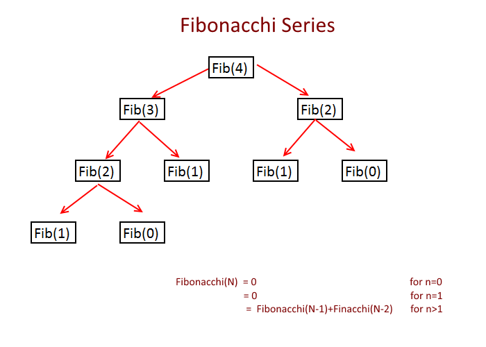

# Dynamic Programming

<!-- MarkdownTOC -->

- [Introduction](#introduction)
- [Steps to Solve Dynamic Programming Problem](#steps-to-solve-dynamic-programming-problem)
- [Classic Models of Dynamic Programming](#classic-models-of-dynamic-programming)
- [Common Formula of State Transition](#common-formula-of-state-transition)
- [References](#references)

<!-- /MarkdownTOC -->

**Dynamic programming** is a computer programming method, that simplifies a complicated problem by breaking it down into simpler sub-problems in a recursive manner.

## Introduction

There are two key attributes that a problem must have in order for dynamic programming to be applicable

- **optimal substructure**: an optimal solution can be constructed from optimal solutions of its subproblems.
- **overlapping sub-problems**: the problem can be broken down into subproblems which are reused several times or a recursive algorithm for the problem solves the same subproblem over and over rather than always generating new subproblems

If a problem can be solved by combining optimal solutions to non-overlapping sub-problems, the strategy is called "[Divide and Conquer](./DivideConquer.md)" instead. This is why merge sort and quick sort are not classified as dynamic programming problems.



Let's use [Fibonacci number](https://en.wikipedia.org/wiki/Fibonacci_number) as an example. This can be resolved in either of two ways

- *Top-down approach*: This is the direct fall-out of the recursive formulation of any problem. If the solution to any problem can be formulated recursively using the solution to its sub-problems, and if its sub-problems are overlapping, then one can easily memoize or store the solutions to the sub-problems in a table. This approach is usually used to solve the problem with tree structure, which starts with the root node and finds all sub-problems in siblings.

```java
int fibonacci(int n, int[] f) {
    if(n == 0) {
        f[0] = 1;
        return f[0]
    }
    if(n == 1) {
        f[1] = 1;
        return f[1];
    }
    if(f[n] != 0) { // 0 means the state is not calculated yet
        return f[n];
    } else {
        f[n] = fibonacci(n-1, f) + fibonacci(n-2, f);
        return f[n];
    }
}
```

- *Bottom-up approach*: Once we formulate the solution to a problem recursively as in terms of its sub-problems, we can try reformulating the problem in a bottom-up fashion: try solving the sub-problems first and use their solutions to build-on and arrive at solutions to bigger sub-problems.

```java
int fibonacci(int n) {
    if(n == 0) return 0;
    if(n == 1) return 1;
    int[] dp = new int[n+1];
    dp[0] = 0;
    dp[1] = 1;
    for(int i = 2; i <=n ; ++i) {
        dp[i] = dp[i-1]+dp[i-2];
    }
    return dp[n];
}
```

**Dynamic programming** amounts to breaking down an optimization problem into simpler sub-problems, and storing the solution to each sub-problem so that each sub-problem is only solved once.

## Steps to Solve Dynamic Programming Problem

## Classic Models of Dynamic Programming

### Linear Model

### Interval Model

### Knapsack Model

### State Compressing Model

### Tree Model

## Common Formula of State Transition

### 1-Dimension

### 2-Dimension

## References

- <https://en.wikipedia.org/wiki/Dynamic_programming>
- <https://www.geeksforgeeks.org/dynamic-programming/>
- <https://dev.to/nikolaotasevic/dynamic-programming--7-steps-to-solve-any-dp-interview-problem-3870>
- <https://www.freecodecamp.org/news/demystifying-dynamic-programming-3efafb8d4296/>
- <http://cppblog.com/menjitianya/archive/2015/10/23/212084.html>
