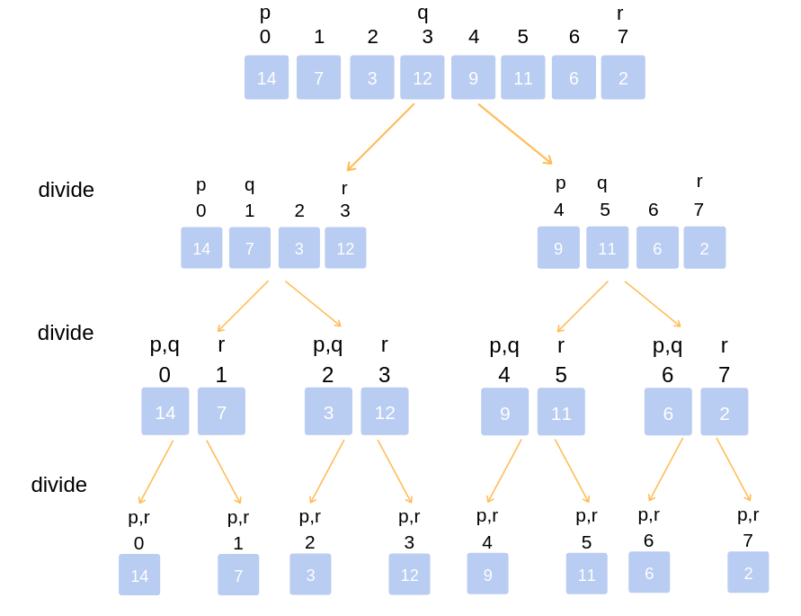
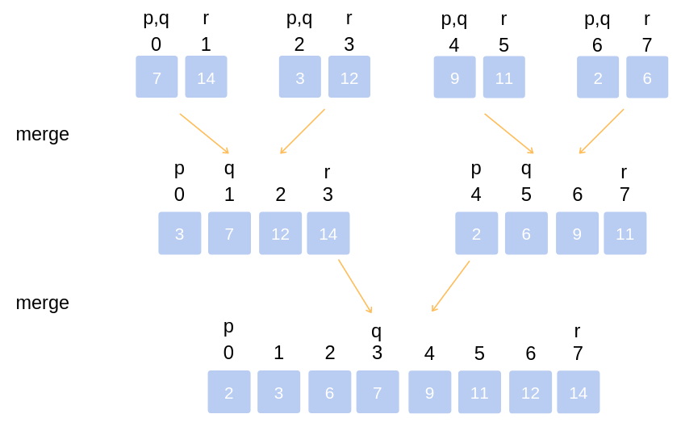

# Sort - _O(nlogn)_ Solutions

<!-- MarkdownTOC -->

- [Quicksort](#quicksort)
  - [Quicksort Workflow](#quicksort-workflow)
  - [Quicksort Algorithm](#quicksort-algorithm)
  - [Quicksort Implementation](#quicksort-implementation)
  - [Quicksort Analysis](#quicksort-analysis)
- [Merge Sort](#merge-sort)
  - [Merge Sort Workflow](#merge-sort-workflow)
  - [Merge Sort Implementation](#merge-sort-implementation)
  - [Merge Sort Time Complexity](#merge-sort-time-complexity)
- [Heapsort](#heapsort)
- [Tree Sort](#tree-sort)

<!-- /MarkdownTOC -->

## Quicksort

Quicksort is an algorithm based on divide and conquer approach in which the array is split into subarrays and these sub-arrays are recursively called to sort the elements.

### Quicksort Workflow

- Divide: The array is divided into subparts taking pivot as the partitioning point. The elements smaller than the pivot are placed to the left of the pivot and the elements greater than the pivot are placed to the right.
- Conquer: The left and the right subparts are again partitioned using the by selecting pivot elements for them. This can be achieved by recursively passing the subparts into the algorithm.
- Combine: This step does not play a significant role in quicksort. The array is already sorted at the end of the conquer step.

### Quicksort Algorithm

```python
quickSort(array, leftmostIndex, rightmostIndex)
  if (leftmostIndex < rightmostIndex)
    pivotIndex <- partition(array,leftmostIndex, rightmostIndex)
    quickSort(array, leftmostIndex, pivotIndex)
    quickSort(array, pivotIndex + 1, rightmostIndex)

partition(array, leftmostIndex, rightmostIndex)
  set rightmostIndex as pivotIndex
  storeIndex <- leftmostIndex - 1
  for i <- leftmostIndex + 1 to rightmostIndex
  if element[i] < pivotElement
    swap element[i] and element[storeIndex]
    storeIndex++
  swap pivotElement and element[storeIndex+1]
return storeIndex + 1
```

### Quicksort Implementation

```java
// Function to partition the array on the basis of pivot element
int partition(int array[], int low, int high) {
    // Select the pivot element
    int pivot = array[high];
    int i = (low - 1);

    // Put the elements smaller than pivot on the left and
    // greater than pivot on the right of pivot
    for (int j = low; j < high; j++) {
        if (array[j] <= pivot) {
        i++;
        int temp = array[i];
        array[i] = array[j];
        array[j] = temp;
        }
    }
    int temp = array[i + 1];
    array[i + 1] = array[high];
    array[high] = temp;
    return (i + 1);
}

void quickSort(int array[], int low, int high) {
    if (low < high) {
        // Select pivot position and put all the elements smaller
        // than pivot on left and greater than pivot on right
        int pivot = partition(array, low, high);

        // Sort the elements on the left of pivot
        quickSort(array, low, pivot - 1);

        // Sort the elements on the right of pivot
        quickSort(array, pivot + 1, high);
    }
}
```

### Quicksort Analysis

- Worst Case Complexity: O(n^2)
- Best Case Complexity: O(n*log n)
- Average Case Complexity: O(n*log n)
- Space Complexity: O(log n)

## Merge Sort

Merge sort (also commonly spelled _mergesort_) is an efficient, general-purpose, comparison-based sorting algorithm. Most implementations produce a _stable sort_, which means that the order of equal elements is the same in the input and output. Merge sort is a _divide and conquer_ algorithm.

### Merge Sort Workflow

Keep dividing the unsorted list into n sub-lists until each one only comprises 1 element (a list of 1 element is supposed sorted).



Repeatedly merge sublists to produce newly sorted sublists until there is only 1 sublist remaining. This will be the sorted list



### Merge Sort Implementation

#### Top-down implementation

```java
void mergeSort(int Arr[], int start, int end) {
    if(start < end) {
        int mid = (start + end) / 2;
        mergeSort(Arr, start, mid);
        mergeSort(Arr, mid+1, end);
        merge(Arr, start, mid, end);
    }
}

void merge(int Arr[], int start, int mid, int end) {

    // create a temp array
    int temp[] = new int[end - start + 1];

    // crawlers for both intervals and for temp
    int i = start, j = mid+1, k = 0;

    // traverse both arrays and in each iteration add smaller of both elements in temp
    while(i <= mid && j <= end) {
        if(Arr[i] <= Arr[j]) {
            temp[k] = Arr[i];
            k += 1; i += 1;
        }
        else {
            temp[k] = Arr[j];
            k += 1; j += 1;
        }
    }

    // add elements left in the first interval
    while(i <= mid) {
        temp[k] = Arr[i];
        k += 1; i += 1;
    }

    // add elements left in the second interval
    while(j <= end) {
        temp[k] = Arr[j];
        k += 1; j += 1;
    }

    // copy temp to original interval
    for(i = start; i <= end; i += 1) {
        Arr[i] = temp[i - start]
    }
}
```

#### Bottom-up implementation

TODO

### Merge Sort Time Complexity

In sorting n objects, merge sort has an average and worst-case performance of O(_nlogn_). If the running time of merge sort for a list of length n is T(n), then the recurrence _T(n) = 2T(n/2) + n_ follows from the definition of the algorithm.

## Heapsort

Heapsort is a comparison-based sorting algorithm. Heapsort can be thought of as an improved selection sort: like selection sort, heapsort divides its input into a sorted and an unsorted region, and it iteratively shrinks the unsorted region by extracting the largest element from it and inserting it into the sorted region. Unlike selection sort, heapsort does not waste time with a linear-time scan of the unsorted region; rather, heap sort maintains the unsorted region in a heap data structure to more quickly find the largest element in each step

## Tree Sort

## References

- <https://www.geeksforgeeks.org/merge-sort/>
- <https://en.wikipedia.org/wiki/Merge_sort>
- <https://en.wikipedia.org/wiki/Heapsort>
- <https://www.programiz.com/dsa/heap-sort>
