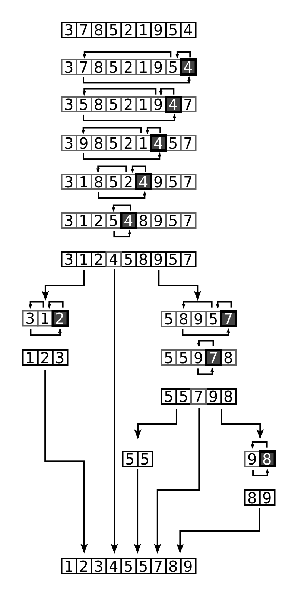

# Sort - _O(nlogn)_ Solutions

<!-- MarkdownTOC -->

- [Quicksort](#quicksort)
  - [Quicksort Workflow](#quicksort-workflow)
  - [Quicksort Algorithm](#quicksort-algorithm)
  - [Quicksort Implementation](#quicksort-implementation)
  - [Quicksort Analysis](#quicksort-analysis)
- [Merge Sort](#merge-sort)
  - [Merge Sort Workflow](#merge-sort-workflow)
  - [Merge Sort Implementation](#merge-sort-implementation)
  - [Merge Sort Time Complexity](#merge-sort-time-complexity)
- [Heapsort](#heapsort)
  - [Complete Binary Tree](#complete-binary-tree)
  - [Heap Data Structure](#heap-data-structure)
  - [Heapify](#heapify)
  - [How Heap Sort Works](#how-heapsort-works)
  - [Heapsort Implementation](#heapsort-implementation)
- [Tree Sort](#tree-sort)
  - [Tree Sort Algorithm](#tree-sort-algorithm)

<!-- /MarkdownTOC -->

## Quicksort

Quicksort is an algorithm based on the divide and conquer approach in which the array is split into subarrays and these sub-arrays are recursively called to sort the elements.

### Quicksort Workflow



- Divide: The array is divided into subparts taking the pivot as the partitioning point. The elements smaller than the pivot are placed to the left of the pivot and the elements greater than the pivot are placed to the right.
- Conquer: The left and the right subparts are again partitioned by selecting pivot elements for them. This can be achieved by recursively passing the subparts into the algorithm.
- Combine: This step does not play a significant role in quicksort. The array is already sorted at the end of the conquer step.

### Quicksort Algorithm

```python
quickSort(array, leftmostIndex, rightmostIndex)
  if (leftmostIndex < rightmostIndex)
    pivotIndex <- partition(array,leftmostIndex, rightmostIndex)
    quickSort(array, leftmostIndex, pivotIndex)
    quickSort(array, pivotIndex + 1, rightmostIndex)

partition(array, leftmostIndex, rightmostIndex)
  set rightmostIndex as pivotIndex
  storeIndex <- leftmostIndex - 1
  for i <- leftmostIndex + 1 to rightmostIndex
  if element[i] < pivotElement
    swap element[i] and element[storeIndex]
    storeIndex++
  swap pivotElement and element[storeIndex+1]
return storeIndex + 1
```

### Quicksort Implementation

```java
// Function to partition the array on the basis of pivot element
int partition(int array[], int low, int high) {
    // Select the pivot element
    int pivot = array[high];
    int i = (low - 1);

    // Put the elements smaller than pivot on the left and
    // greater than pivot on the right of pivot
    for (int j = low; j < high; j++) {
        if (array[j] <= pivot) {
            i++;
            int temp = array[i];
            array[i] = array[j];
            array[j] = temp;
        }
    }
    int temp = array[i + 1];
    array[i + 1] = array[high];
    array[high] = temp;
    return (i + 1);
}

void quickSort(int array[], int low, int high) {
    if (low < high) {
        // Select pivot position and put all the elements smaller
        // than pivot on left and greater than pivot on right
        int pivot = partition(array, low, high);

        // Sort the elements on the left of pivot
        quickSort(array, low, pivot - 1);

        // Sort the elements on the right of pivot
        quickSort(array, pivot + 1, high);
    }
}
```

### Quicksort Analysis

- Worst Case Complexity: O(n^2)
- Best Case Complexity: O(n*log n)
- Average Case Complexity: O(n*log n)
- Space Complexity: O(log n)

## Merge Sort

Merge sort (also commonly spelled _mergesort_) is an efficient, general-purpose, comparison-based sorting algorithm. Most implementations produce a _stable sort_, which means that the order of equal elements is the same in the input and output. Merge sort is a _divide and conquer_ algorithm.

### Merge Sort Workflow

Keep dividing the unsorted list into n sub-lists until each one only comprises 1 element (a list of 1 element is supposed sorted).


Repeatedly merge sublists to produce newly sorted sublists until there is only 1 sublist remaining. This will be the sorted list


### Merge Sort Implementation

#### Top-down implementation

```java
void mergeSort(int Arr[], int start, int end) {
    if(start < end) {
        int mid = (start + end) / 2;
        mergeSort(Arr, start, mid);
        mergeSort(Arr, mid+1, end);
        merge(Arr, start, mid, end);
    }
}

void merge(int Arr[], int start, int mid, int end) {

    // create a temp array
    int temp[] = new int[end - start + 1];

    // crawlers for both intervals and for temp
    int i = start, j = mid+1, k = 0;

    // traverse both arrays and in each iteration add smaller of both elements in temp
    while(i <= mid && j <= end) {
        if(Arr[i] <= Arr[j]) {
            temp[k] = Arr[i];
            k += 1; i += 1;
        }
        else {
            temp[k] = Arr[j];
            k += 1; j += 1;
        }
    }

    // add elements left in the first interval
    while(i <= mid) {
        temp[k] = Arr[i];
        k += 1; i += 1;
    }

    // add elements left in the second interval
    while(j <= end) {
        temp[k] = Arr[j];
        k += 1; j += 1;
    }

    // copy temp to original interval
    for(i = start; i <= end; i += 1) {
        Arr[i] = temp[i - start]
    }
}
```

#### Bottom-up implementation

```java
// Merge two sorted sub-arrays A[from .. mid] and A[mid + 1 .. to]
public static void merge(int[] A, int[] temp, int from, int mid, int to) {
    int k = from, i = from, j = mid + 1;

    // loop till there are elements in the left and right runs
    while (i <= mid && j <= to) {
        if (A[i] < A[j]) {
            temp[k++] = A[i++];
        } else {
            temp[k++] = A[j++];
        }
    }

    // Copy remaining elements
    while (i <= mid) {
        temp[k++] = A[i++];
    }

    // Don't need to copy second half

    // copy back to the original array to reflect sorted order
    for (i = from; i <= to; i++) {
        A[i] = temp[i];
    }
}

// Iteratively sort array A[low..high] using temporary array
public static void mergesort(int[] A) {
    int low = 0;
    int high = A.length - 1;

    // sort array A[] using temporary array temp
    int[] temp = Arrays.copyOf(A, A.length);

    // divide the array into blocks of size m
    // m = [1, 2, 4, 8, 16...]
    for (int m = 1; m <= high - low; m = 2*m) {
        // for m = 1, i = 0, 2, 4, 6, 8...
        // for m = 2, i = 0, 4, 8, 12...
        // for m = 4, i = 0, 8, 16...
        // ...
        for (int i = low; i < high; i += 2*m) {
            int from = i;
            int mid = i + m - 1;
            int to = Integer.min(i + 2 * m - 1, high);

            merge(A, temp, from, mid, to);
        }
    }
}
```

### Merge Sort Time Complexity

In sorting n objects, merge sort has an average and worst-case performance of O(_nlogn_). If the running time of merge sort for a list of length n is T(n), then the recurrence _T(n) = 2T(n/2) + n_ follows from the definition of the algorithm.

## Heapsort

Heapsort is a comparison-based sorting algorithm. Heapsort can be thought of as an improved selection sort: like selection sort, heapsort divides its input into a sorted and an unsorted region, and it iteratively shrinks the unsorted region by extracting the smallest or largest element from it and inserting it into the sorted region. Unlike selection sort, heapsort does not waste time with a linear-time scan of the unsorted region; rather, heap sort maintains the unsorted region in a heap data structure to more quickly find the largest element in each step

### Complete Binary Tree

A complete binary tree has an interesting property that we can use to find the children and parents of any node.

If the index (0-based) of any element in the array is _i_, the element in the index _2i+1_ will become the left child and element in _2i+2_ index will become the right child. Also, the parent of any element at index _i_ is given by the lower bound of _(i-1)/2_.


### Heap Data Structure

Heap is a special tree-based data structure. A binary tree is said to follow a heap data structure if

- It is a complete binary tree.
- All nodes in the tree follow the property that they are greater than their children i.e. the largest element is at the root and both its children and smaller than the root and so on. Such a heap is called a max-heap. If instead, all nodes are smaller than their children, it is called a min-heap.

The following example diagram shows Max-Heap and Min-Heap.


### Heapify

Starting from a complete binary tree, we can modify it to become a Max-Heap by running a function called heapify on all the non-leaf elements of the heap.

```java
void heapify(int arr[], int n, int i) {
  // Find largest among root, left child and right child
  int largest = i;
  int left = 2 * i + 1;
  int right = 2 * i + 2;

  if (left < n && arr[left] > arr[largest])
    largest = left;

  if (right < n && arr[right] > arr[largest])
    largest = right;

    // Swap and continue heapifying if root is not largest
    if (largest != i) {
      swap(&arr[i], &arr[largest]);
      heapify(arr, n, largest);
  }
}
```


### How Heapsort Works

- Since the tree satisfies Max-Heap property, then the largest item is stored at the root node.
- Swap: Remove the root element and put at the end of the array (nth position) Put the last item of the tree (heap) at the vacant place.
- Remove: Reduce the size of the heap by 1.
- Heapify: Heapify the root element again so that we have the highest element at root.
- The process is repeated until all the items of the list are sorted.


### Heapsort Implementation

```java
public void sort(int arr[]) {
    int n = arr.length;

    // Build max heap
    for (int i = n / 2 - 1; i >= 0; i--) {
        heapify(arr, n, i);
    }

    // Heap sort
    for (int i = n - 1; i >= 0; i--) {
        int temp = arr[0];
        arr[0] = arr[i];
        arr[i] = temp;

        // Heapify root element
        heapify(arr, i, 0);
    }
}

void heapify(int arr[], int n, int i) {
    // Find largest among root, left child and right child
    int largest = i;
    int l = 2 * i + 1;
    int r = 2 * i + 2;

    if (l < n && arr[l] > arr[largest])
        largest = l;

    if (r < n && arr[r] > arr[largest])
        largest = r;

    // Swap and continue heapifying if root is not largest
    if (largest != i) {
        int swap = arr[i];
        arr[i] = arr[largest];
        arr[largest] = swap;

        heapify(arr, n, largest);
    }
}
```

## Tree Sort

Tree sort is a sorting algorithm that is based on Binary Search Tree data structure. It first creates a binary search tree from the elements of the input list or array and then performs an in-order traversal on the created binary search tree to get the elements in sorted order.

### Tree Sort Algorithm

- Take the elements input in an array.
- Create a Binary search tree by inserting data items from the array into the binary search tree.
- Perform in-order traversal on the tree to get the elements in sorted order.

## References

- <https://www.geeksforgeeks.org/merge-sort/>
- <https://en.wikipedia.org/wiki/Merge_sort>
- <https://en.wikipedia.org/wiki/Heapsort>
- <https://www.programiz.com/dsa/heap-sort>
- <https://www.geeksforgeeks.org/tree-sort/>
